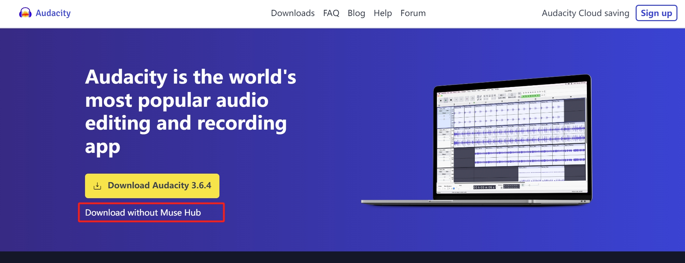
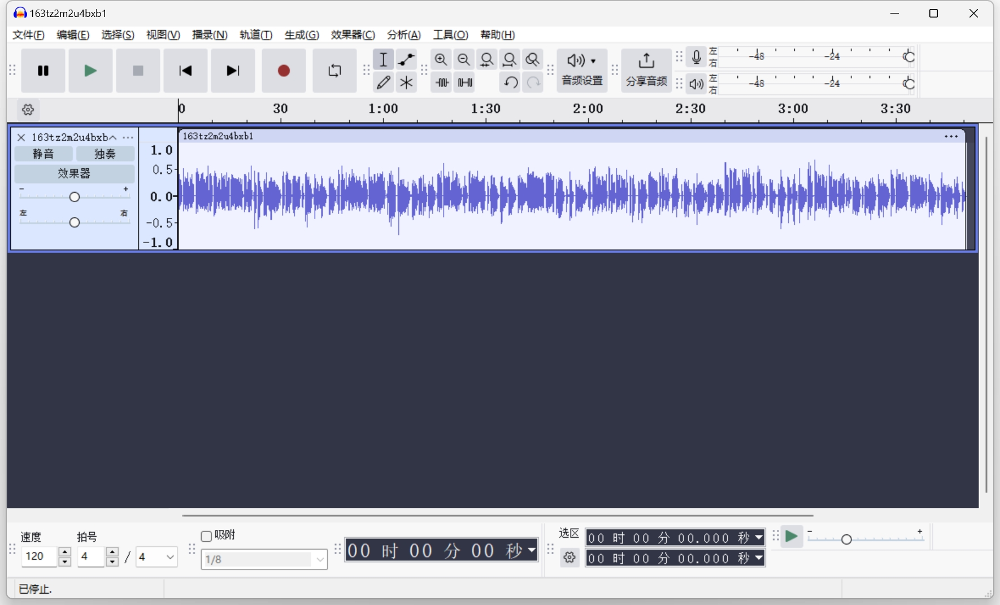
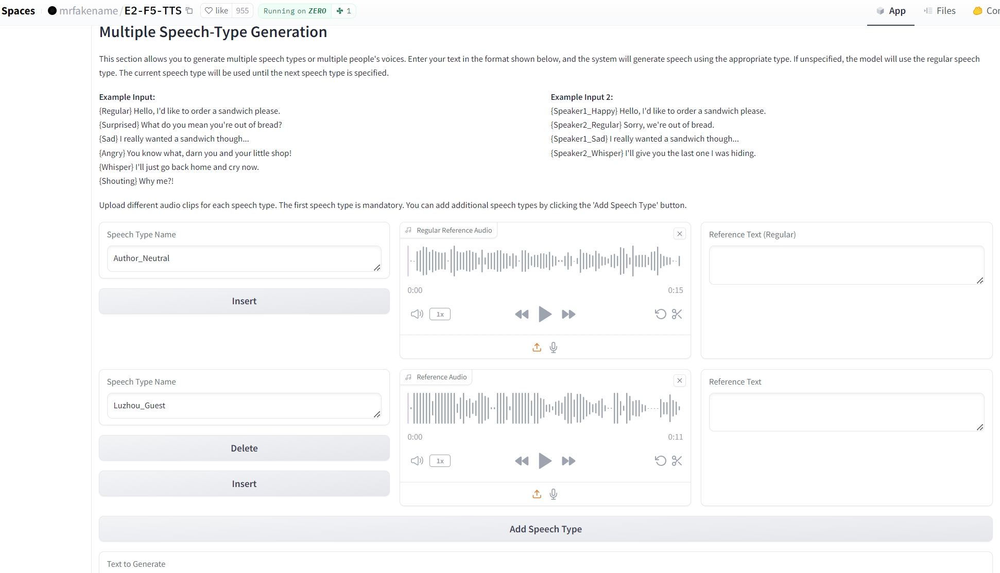
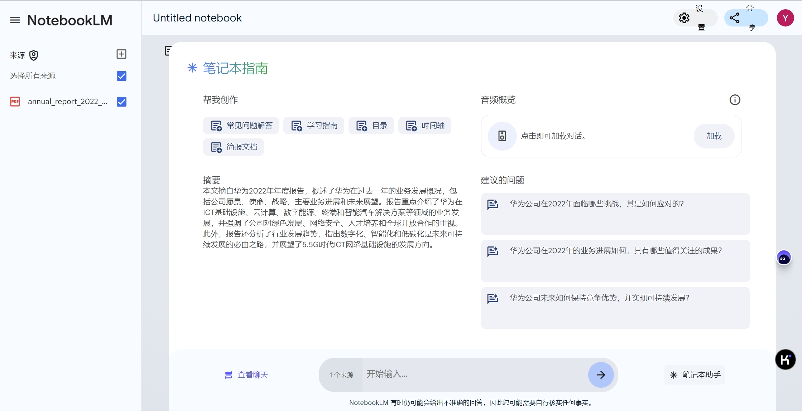
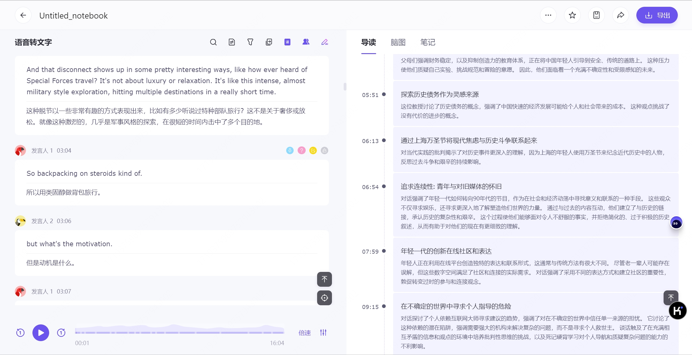

{/* 导入必要的样式和组件 */}
import '../../styles/markdown.css'
import React, { useState } from 'react';
import { Counter } from '../../components/react/Spinner';
import { Collapsible, Alert, CodeBlock, Highlight, FadeIn } from '../../components/react/Collapsible';
import { Tabs } from '../../components/react/Tabs';
import { Image } from 'astro:assets';
import ImageSwitcher from '../../components/react/ImageSwitcher';
import Video from '../../components/react/Video';

# 背景信息
[谷歌AI播客刚火，Meta就开源了平替，效果一言难尽](https://mp.weixin.qq.com/s/WF02SzrNSxZEKQr7IyNsSg)

[NotebookLM +PodLM + F5：AI播客系列，个性化中英文播客（本地安装、Colab部署）](https://mp.weixin.qq.com/s/J3WqebtCR09vzEB3g2JDzw)

[AI+播客？这个智能体让你变的更专业！](https://mp.weixin.qq.com/s/yp1kq8YXfNjp5axxjLrNHA)

[HeyGen5.0来了！ 上线实时数字人聊天和视频翻译功能（详细操作指南）](https://mp.weixin.qq.com/s/PP6cubZgfPUQkdKBV41QbA)

[连续24小时直播不停歇，靠的是AI数字人！（推荐6款工具）](https://mp.weixin.qq.com/s/7QbMA56Vv2zBJhJfAngVtw)

[Podlm](https://github.com/lihuithe/podlm-public?tab=readme-ov-file)
# 初步思路
- 研报、论文的阅读，类似谷歌illumination。

- 古文赏析——英文版

- 用GPT生成播客文稿、用NotebookLM生成播客音频、用Heygen生成播客视频

- GPT生成文稿、MD生成画面、NotebookLM配上解说。

- AI资讯、财经资讯爬取，用数据库存储，用GPT生成文稿，用NotebookLM生成音频

# 目前难点

1. NotebookLM生成的是英文
2. Meta的NotebookLLama还没找到开源路径
3. Heygen数字人单一角色
4. MD的生成画面不够稳定

# 目前成果
## 1. TTS所需音频剪辑
TTS建议是一段不超过15秒的音频，所以开始找了很久音频剪辑的工具。真的是什么都是收费的。最后发现了Audacity。
Audacity的[官方网站](https://www.audacityteam.org/)，可以通过这个网站下载软件、获取用户手册和教程。选择Download without Muse Hub。
<div style="display: flex; justify-content: center; align-items: center;">
  
</div>
Audacity是一款免费、开源的音频编辑和录音软件，广泛应用于音乐制作、广播后期制作以及普通用户的音频处理。
它支持多种操作系统，包括Windows、macOS和Linux，提供了直观的用户界面和强大的音频处理工具。Audacity的核心功能包括音频录制、编辑、效果处理、多轨混音等，用户可以通过剪切、复制、粘贴等基本编辑操作，以及应用各种音频效果来改善和创作音频内容。
<div style="display: flex; justify-content: center; align-items: center;">
  
</div>
使用了最基本的功能，在最下方选取选择需要截取的片段时间，然后直接导出即可。

## 2. 通过F5-TTS生成播客
通过F5-TTS可以结合多人的音频，配合文本内容，很好的生成一个访谈的播客，声音模仿度很高。
目前可执行路径参考AI进修生的[Colab执行文件](https://colab.research.google.com/drive/1KoMvZQyxXiE3bw00_InCyNDbD4WkPlNr?pli=1#scrollTo=1XuoyxM0F3-_)，在T4模式下运行。
**如果需要长期稳定运行，需要搭建家里电脑的本地环境** T4的连接非常的不稳定。但是基础环境配置、速度的确快。
注：Colab的运行参考了[AI进修生](https://mp.weixin.qq.com/s/J3WqebtCR09vzEB3g2JDzw)的发文，因为F5-TTS更新了，我还线上咨询了博主做了修改。

<div style="display: flex; justify-content: center; align-items: center;">
  
</div>
为了构建播客模式，需要做的是根据提示提供不同人物、语气的人物声音输入，配合后续需要配音的文本内容。比如有regular、
Surprised、Sad、Angry、Whisper、Shouting等。或者发言人1、发言人2的声音类似。然后在生成文本前缀给以匹配，运行得到的
音频就可以很好的实现对应的聊天效果。多人都可以。
```
{Regular} Hello, I'd like to order a sandwich please.
{Surprised} What do you mean you're out of bread?
{Sad} I really wanted a sandwich though...
{Angry} You know what, darn you and your little shop!
{Whisper} I'll just go back home and cry now.
{Shouting} Why me?!

Example Input 2:
{Speaker1_Happy} Hello, I'd like to order a sandwich please.
{Speaker2_Regular} Sorry, we're out of bread.
{Speaker1_Sad} I really wanted a sandwich though...
{Speaker2_Whisper} I'll give you the last o
```
我从播客的录音中截取了两个人分别十几秒的音频，作为输入了。
<Alert type="info" title="音频文件">
  <audio controls style="width: 100%; max-width: 500px;">
    <source src="/SeanBlog/Audios/AIBoke01-Speaker1.mp3" type="audio/mpeg" />
    您的浏览器不支持音频播放。为啥没有了
  </audio>
  <audio controls style="width: 100%; max-width: 500px;">
    <source src="/SeanBlog/Audios/AIBoke01-Speaker2.mp3" type="audio/mpeg" />
    您的浏览器不支持音频播放。为啥没有了
  </audio>
</Alert>

同时节选了后面他们一段对话的文字脚本，按照需要的格式输入给TTS
```
{Speaker1} 修养算是最最看重最能加分的，那如果说最能扣分的品质，你觉得是哪一两个关键词？
{Speaker2} 如果从我心理学的角度来说，我会把这个成瘾性放进去，就是赌博。哇哦我会把赌博的成瘾性放进去，就是赌博博障碍。
{Speaker1} 赌博障碍这个东西正好就引到我们，等会要重要的我们股民的这个心态。赌博障碍这个词或者说成瘾性可能在某些投资人去评判创业者的时候，他甚至是一个正面的。比如说我记得宁德时代的对那个曾总曾就是曾老板，他的办公室就挂着一个叫赌性坚强。
{Speaker2} 没错，所以我刚刚在您在问我这个问题的时候，我是说从我的这个角度，确实是我虽然是学经济学这个宏观经济，我更多的还是看重这个风险厌恶型风险厌恶，我还是比较偏向于这样的确。
{Speaker1} 确实赌性或者说成瘾性的这个是不是持续的全部压上去下重注，这是一个非常两面化的问题。没错，没有标准答案。
{Speaker2} 没错。
{Speaker1} 这个也是我们在股市，就是股民我们这个群体当中很容易出现的一种心态。就是经常我们有个表情包就是满仓干，不要怂。对什么赢了会所嫩模，输了下海干活，是这个就深刻的很生动的表达了我们某些股民的一些心态。其实我我在我们录这期之前，我是想了很多我们股民容易遇到一些心理问题。我还专门查了集体就是基PT，就是官方的或者机器人告诉我答案。我就问股民有什么典型的情绪？那当然就列了很多了，比如说追涨杀跌、贪婪、恐惧还有什么？我还我还记录了一下狂躁、焦虑、悔恨、盲目自信、炫耀、从众，反正就是我觉得是人性的，各种情绪都有，股市或者说其他的资本市场它会把它放的更大我觉得我们很难就每一个情绪来展开，但我想了几种情绪是我我自己近期深刻体会到的。
{Speaker1} 比如你看我们今天录制的时间是10月20号，在我们这个国庆节。假期的那几天我们的A股是暴涨的，那个不叫大涨，是叫暴涨，直线拉升。所以叠加当时这个上涨的这种情况，和当时一些自媒体推波助澜。所以在我的观察中，整个国庆假期只要是你炒股的或者接触到这些信息的人，可能他们都很焦虑的在想办法去筹钱。没错，甚至还有说排队开户。然后那些券商还都说有些孩子国庆假期不休息。对，加班加点开户。
{Speaker1} 那种时候我就感觉自己和身边人沉浸在一种焦虑，一种狂躁的状态。我们怕什么呢？我们怕赶不上这趟了。
{Speaker1} 对应到我们股市中一个专有名词叫踏空。没错，踏空的反义词叫被套，这不叫反义词义词就反面的情况，我给大家稍微解释一下，这个相信我们的听众应该都知道。被套就是你买了之后，比如说十块钱买一个股票，然后来跌了，跌到九块钱、八块钱你都不舍得卖，你就想等他有一天回来就要被套。那踏空是什么意思呢？就是我有两个股票可以选，比如说A和B那我买了B没买A结果B就结果结果没买的那个A股票就暴涨，那B没有涨，这是一种踏空形式。还有一种就是我在大涨之前卖了它，也就是就踏空暴涨那也是踏空。还有另外一种是可能是我觉得这个是个机会，但是犹豫了一下没买，心态上也觉得自己是踏空了。是的，我自己的感受以及我身边的感受是踏空其实比被套要难受很多很多。
```
就可以得到以下这段对话，可以听出来声音的完成度非常好。
<Alert type="info" title="音频文件">
  <audio controls style="width: 100%; max-width: 500px;">
    <source src="/SeanBlog/Audios/AIBoke02-TTS.wav" type="audio/wav" />
    您的浏览器不支持音频播放。为啥没有了
  </audio>
</Alert>

## 3.用NotebookLM生成英文播客音频+通义千问生成中文翻译脚本
<div style="display: flex; justify-content: center; align-items: center;">
  
</div>

NotebookLM基于谷歌Gemini-1.5，可以实现上传文档的RAG，供使用者进行提问、总结，并且可以聊天。同时最关键的是可以自动
生成一个十几分钟的播客对话音频。是一男一女的英文对话。如果是未来投放国外媒体平台，这就非常适合。对话的整体质量语音语调都很自然。

<div style="display: flex; justify-content: center; align-items: center;">
  
</div>

我做了进一步的尝试。使用了熟悉的通义千问，针对英文的音频也做了非常好的内容提取。同时可以直接提供中文翻译脚本。不过翻译更
偏向于直译，没有很好的语境。所以为了获取更好的中文翻译，我把导出的英文原文对话提供给GPT进行重新翻译。可以得到以下的内容：
```
{Regular} 好的，今天我们要深入探讨一个非常有趣的话题，那就是华为2022年的年度报告。
{Speaker2} 哦，对，我自己也有机会看过了。
{Regular} 是的，这非常有意思，因为它不仅仅是你知道的那种典型的财务数据，它更多的是关于他们对未来的愿景，以及他们如何在这个快速变化的科技领域中定位自己。
{Speaker2} 是的，几乎像是他们对未来世界的路线图，说明他们如何成为其中的一部分。
{Regular} 没错，有一件事立刻吸引了我，那就是他们谈论所面临的挑战时的态度。他们并没有回避那些困难和逆境，而是以一种非常有趣的方式呈现出来。
{Speaker2} 对，他们用梅花的比喻对吧？你知道，梅花即使在最严寒的冬天也能盛开。
{Regular} 没错，就像他们在说：“我们经历了很多，但我们不仅仅是活下来了，我们还要盛开。”
{Speaker2} 对，这种基调贯穿了整份报告，充满了韧性，即使面对逆境也是如此。
{Regular} 是的，这引出了他们的宏大愿景，构建一个完全连接的智能世界。这到底是什么意思呢？
{Speaker2} 这远远超出了我们今天所知的智能手机和互联网的范畴，他们谈论的是无处不在的连接。所以，一切都被连接起来，设备、车辆、基础设施，方方面面。
{Regular} 所以基本上所有东西都在互相对话。
{Speaker2} 没错，不仅仅是连接设备，而是让这些连接变得智能化。这样你就会有无处不在的智能，网络能够自我管理，AI驱动的解决方案无处不在，信息在生活的各个方面无缝流动。
{Regular} 这就像是把互联网提升到了一个新层次，不仅连接人，还连接一切，并让它们变得智能。
{Speaker2} 对，他们还强调了这种方式将为各个行业创造巨大机会，从医疗、教育到交通和制造业。
{Regular} 这是一个非常大胆的愿景。他们并没有回避其中的巨大障碍，比如提到那些“非智能因素”和复杂的外部环境。
{Speaker2} 对，这是一种外交辞令，承认诸如制裁和全球经济放缓等问题。
{Regular} 是的，所以他们并没有假装一切都是一帆风顺的，但也没有让这些挑战把他们困住。
{Speaker2} 没错，相反，他们将重点放在可以掌控的事情上，也就是他们的增长战略。这就是他们的GUIDE战略的由来。
{Regular} 哦，是的，GUIDE战略。我必须承认，我很喜欢这种缩写。那么GUIDE背后有什么故事？
{Speaker2} 这不仅仅是一个好听的缩写，它实际上是他们在这个复杂环境中导航并实现他们所设想的智能未来的蓝图。
{Regular} 好吧，每个字母代表一个关键领域，对吧？
{Speaker2} 没错。我们来逐一解释。G代表的是“千兆比特计划”，听起来很宏大，这是什么意思？
{Regular} 是啊，可以理解为为其他一切打下基础，它关乎的是超高速连接。
{Speaker2} 就是说像超级快的互联网无处不在。
{Regular} 对，但不仅仅是这样，它是能够处理海量数据的基础设施，能够无缝连接数十亿个设备。他们谈论的是推动5G及其后续发展的边界，创造他们称之为的5.5G时代。
{Regular} 5.5G？难道5G已经过时了吗？
{Speaker2} 不，这可以理解为增强版的5G。不仅仅是手机上的更快下载，而是容量和可靠性的指数级提升。我们在谈论的是像工业机器人实时控制、全息通信以及融合现实与数字世界的沉浸式体验。
{Regular} 好吧，现在你说的我能理解了，这听起来非常令人惊叹。
{Speaker2} 这些连接将支持他们谈论的所有其他惊人技术。
{Regular} 所以这就是GUIDE中的G，那U代表什么？
{Speaker2} U代表的是超自动化。
{Regular} 加速超自动化，也就是让事情变得更高效。
{Speaker2} 对，但在更大的层面上，他们谈论的是让网络更智能、更能自我管理。想象一下，网络可以实时优化性能，预测并预防故障，并根据需求的变化自动调整。
{Regular} 所以基本上就是网络可以自己“思考”。
{Speaker2} 没错，随着数据量和连接设备的激增，我们不能再依赖人类去管理这一切。我们需要网络能够处理大部分复杂性。
{Regular} 这确实很有道理。那I代表智能吧？
{Speaker2} 对，I代表智能计算和网络即服务。
{Regular} 哦，这个有点复杂，用简单的话怎么解释？
{Speaker2} 它意味着他们希望让强大的计算资源，比如处理能力、AI能力、存储能力，像电力一样容易获取。
{Regular} 就像插入一个数字电网。
{Speaker2} 没错，与其让企业自己构建和管理昂贵的基础设施，他们可以借助华为的云平台，在需要时获取所需的计算能力。
{Regular} 所以这是让强大的技术普及化，任何人都能使用，而不仅仅是大企业。
{Speaker2} 对，它可以平衡竞争，让小企业也能和大公司竞争。
{Regular} 这是一个非常有吸引力的价值主张。那D呢？
{Speaker2} D代表的是按需的差异化体验。我们正在远离“一刀切”的解决方案，走向一个技术为个人需求和偏好量身定制的世界。
{Regular} 就像是个性化的互联网。
{Speaker2} 是的，个性化的互联网，你可能还真会觉得广告有用。
{Regular} 可能有争议，但我明白了这个概念。它是通过数据和AI创造更相关、更吸引人、最终对用户更有价值的体验。
{Speaker2} 正是如此，它关乎于在用户所处的位置上满足他们，按他们想要的方式提供他们需要的东西。
{Regular} 最后，E代表的是ESG，更少的能耗，更多的比特。
{Speaker2} 没错，这是可持续发展的部分。
{Regular} 这关乎于减少他们的环境影响。
{Speaker2} 对，但这不仅仅是他们自己的环保操作，而是通过技术帮助其他行业变得更可持续。
{Regular} 所以不仅是让自己的业务变得更环保，还要用技术产生更广泛的影响。
{Speaker2} 没错，他们正在投资开发更节能的网络设备和数据中心，研究智能电网以更高效地整合可再生能源。他们甚至提到使用AI来优化城市交通流量以减少排放。
{Regular} 哇，他们确实在全方位思考可持续发展。
{Speaker2} 有趣的是，他们认为这种对可持续发展的承诺不仅是道德责任，也是商业机会。
{Regular} 他们相信可持续性将成为未来的关键差异化因素，他们正在将自己定位为这一领域的领导者。
{Speaker2} 完全正确。消费者和投资者越来越多地要求公司认真对待可持续发展，而华为显然在倾听。
```
偷懒一下，还是用之前的两端人声，训练得到了以下由NotebookLM生成的播客中文版音频。

<Alert type="info" title="音频文件">
  <audio controls style="width: 100%; max-width: 500px;">
    <source src="/SeanBlog/Audios/AIBoke03-TTS.wav" type="audio/wav" />
    您的浏览器不支持音频播放。为啥没有了
  </audio>
</Alert>

可能是因为角色音频参考文件的原因（有背景音乐等），生成的音频有一些“哦”、“呼”的声音，而且可以看到转译的文本有比较多的
语气词进行衔接，这个可以在GPT的文本翻译中进行优化。避免对话衔接过于的生硬。

# 下一步尝试
## 1. 播客文本的生成
GPT生成故事性脚本/爬取总结信息咨询/使用现成的文本、书籍进行文本内容的生成。基于NotebookLM、或者Kimi的长上下文、GPT短文都可以。

## 2. 用Midjourney生成风格同意的故事画面
这一步人工干预度比较高，对画面的风格要有一定的把控和调试。但之前想到的，比如做古诗词的视频，似乎对图片要求并不高，
能做到图文对应就可以。如果是一个连贯的故事，可能对画面要求会更高。

同样，如果是关于资讯的总结也可以比较好应对，每则消息之间关联度很多，图片可以用新闻图片或者单独生成。

## 3. 用F5-TTS生成每个画面对应的音频，可以是对话的形式
对于播报的声音最好要选择一下。

## 4. 用剪映将图片、音频进行整合，配上背景音乐
这个开始可能会需要一点时间，对齐音频和画面、文字插入等等。

## 5. 将导出的视频发布在小红书、抖音、Tictok、YouTube等平台
