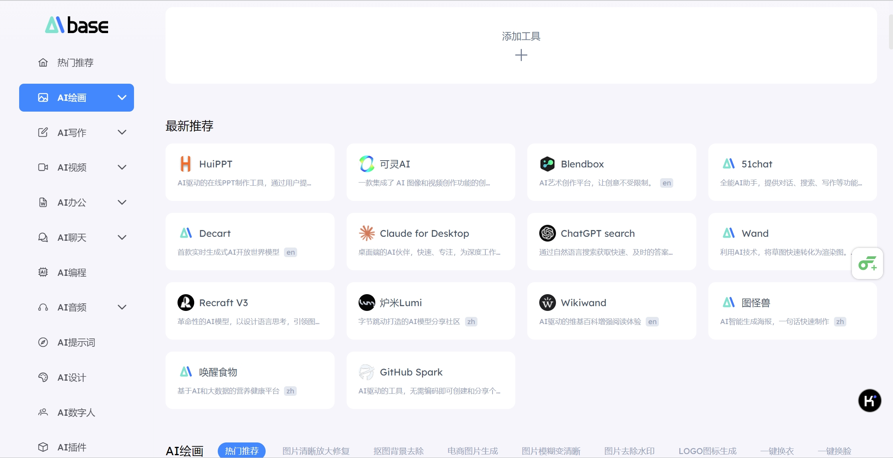

{/* 导入必要的样式和组件 */}
import '../../styles/markdown.css'
import React, { useState } from 'react';
import { Counter } from '../../components/react/Spinner';
import { Collapsible, Alert, CodeBlock, Highlight, FadeIn } from '../../components/react/Collapsible';
import { Tabs } from '../../components/react/Tabs';
import { Image } from 'astro:assets';
import ImageSwitcher from '../../components/react/ImageSwitcher';
import Video from '../../components/react/Video';

因为个人偏好的原因，使用和关注的类型肯定有一点的倾向性。首先想到的是把所有涉足的产品进行一个记录，然后分类以及#标签 完全可以先参考AIBase。
我注意到，因为目前很多大模型公司具备了多模态多业态的产品，所以不一定一个产品只会被分到一个目录下。可能出现属于多个#的情况。

目前已使用产品：

# 一、AI对话类
## ChatGPT
## Kimi
## Claude
## 通义千问
## ChatGLM

# 二、AI绘图、模型类
## Midjourney
### 1. 产品地址
**[Discord访问](https://discord.com/channels/@me)** ：通过在Discord加入Midjourney的机器人，进行对话生成图片。
**[Alpha网页版](https://alpha.midjourney.com/imagine)**：通过网页版可以额外体验Edit、Retexture、personalize等功能。
### 2. 使用技巧
### 3. 使用心得
## Stable Diffusion
[SD 3.5](https://platform.stability.ai/docs/api-reference#tag/Generate/paths/~1v2beta~1stable-image~1generate~1ultra/post)
[Hugging Face](https://huggingface.co/stabilityai/stable-diffusion-3.5-large)

## Flux
[Flux Hugging Face API](https://huggingface.co/black-forest-labs/FLUX.1-dev)
## Tripo 3D
## BibiGPT

# 三、AI音乐、视频类
## F5 TTS
[F5 TTS Huggingface](https://huggingface.co/SWivid/F5-TTS)，[Github](https://github.com/SWivid/F5-TTS) 

## Runway
## 海螺AI
### 1. 产品地址
[海螺AI](https://hailuoai.com/)

### 2. 使用技巧
- 网页包括了对话、音频生成和视频生成。目前视频生成是可以根据图片、**中文提示词**免费生成大约6s的视频。

# 四、AI编程类
## Cursor
## Copilot
## 豆包代码练习
[豆包](https://www.marscode.cn/practice/on6ow09w8ojo8q?)

# 五、AI插件
## Kimi浏览器插件
## 

# 六、AI论文类
## [腾讯元宝](https://yuanbao.tencent.com/chat/naQivTmsDa)
数字卡兹关于腾讯元宝的介绍[《体验完腾讯元宝的深度阅读，我觉得我以后的论文和研报有救了》](https://mp.weixin.qq.com/s/vJf1KMmHXWMdtCxQa8VKQA)

## [Paper Cool]（https://papers.cool/）
一个基于Kimi论文总结，接入了Kimi的api，设置了提示词，总结了论文的主要内容、技术路线、解决的问题的，还可以转跳kimi进行深度阅读

## [NotebookLM](https://notebooklm.google/)
针对输入内容提供理解和整理，并且可以生成一段十几分钟博客讲解。

# 七、含AI的产品及应用
## 心光
## Flomo
## Cubox
## 微信读书
## 夸克浏览器
## AnythingLLM
## [Aino World](https://aino.world/qgis/)
一个自然语言交互的地图类数据分析处理可视化网页。

