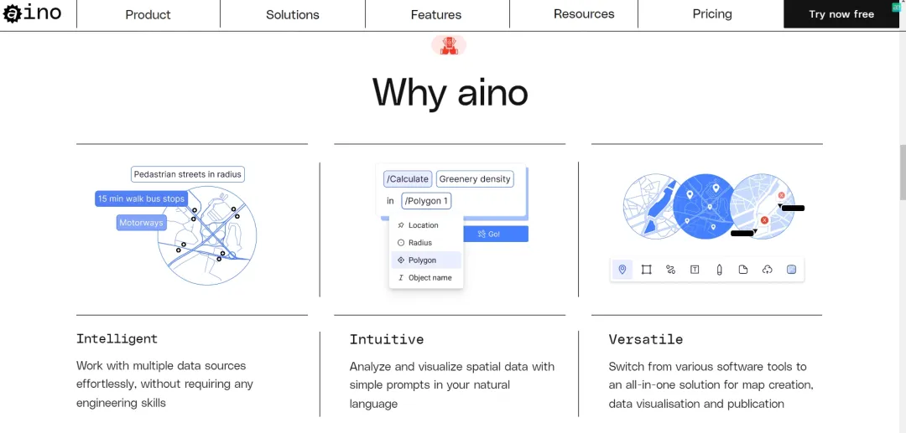
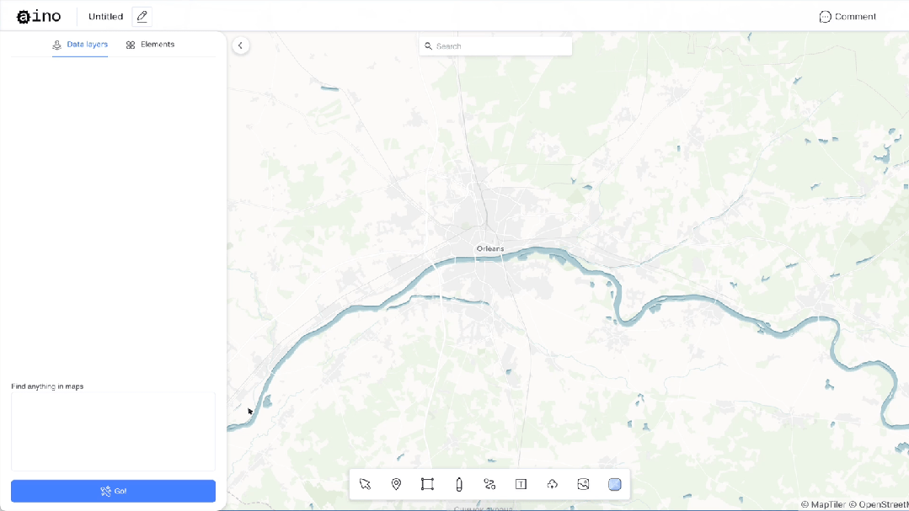
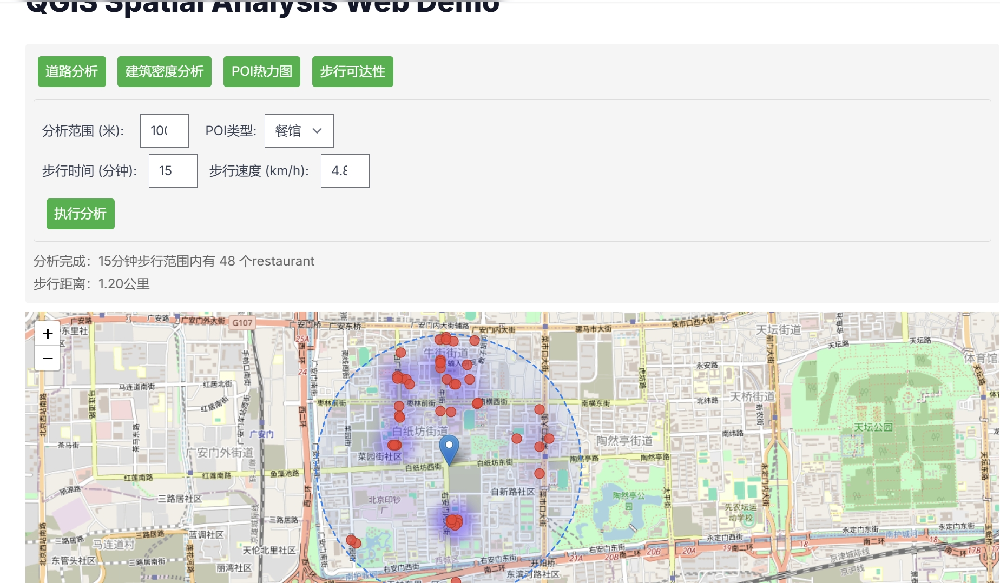

{/* 导入必要的样式和组件 */}
import '../../styles/markdown.css'
import React, { useState } from 'react';
import { Counter } from '../../components/react/Spinner';
import { Collapsible, Alert, CodeBlock, Highlight, FadeIn } from '../../components/react/Collapsible';
import { Tabs } from '../../components/react/Tabs';
import { Image } from 'astro:assets';
import ImageSwitcher from '../../components/react/ImageSwitcher';
import Video from '../../components/react/Video';

> 曾经在浏览各种关于建筑相关领域的AI应用时，发现了一个叫[Aino World](https://aino.world/)的网站，发现其实现的原理就是通过调用QGIS的API以及OpenStreetMap的数据来生成分析图。

查了LinkedIn，发现这个网站的公司是一个八个人团队，包括了2个前端，2个负责AI的，还有CTO、COO、CFO、CEO。网站实现了通过
自然语言的方式，转换成QGIS的编程语言，然后调取对应API，结合数据进行可视化展示。

之前凭借10次免费对话体验使用了这个产品之后，也只是感慨对于建筑规划领域做分析的人非常有用，但日常很难接触到这个领域，所以也就没有深入研究。
最近一个是想帮一毛能不能用AI出一些分析图。另一个更大的启发是与朋友聊天，她有一个课题需求，想类似将人工GIS分析变成一些更简单、自动的操作。
毕竟GIS的使用还是比较有门槛，对于政府人员还是很难上手。我就联想到了这个项目。也尝试思考它的实现原理。整个探索过程主要有以下几个关键点：
1. 最核心的GIS分析开始不知道怎么处理，后来发现有成熟的QGIS模块可以调用，有一个PYQGIS。
- [QGIS Desktop 3.34 User Guide](https://docs.qgis.org/3.34/pdf/cs/QGIS-3.34-DesktopUserGuide-cs.pdf)
- [QGIS API Documentation 3.41.0-Master](https://api.qgis.org/api/)
- [QGIS Resources](https://www.qgis.org/resources/hub/)
- [PyQGIS Developer Cookbook](https://docs.qgis.org/3.34/en/docs/pyqgis_developer_cookbook/intro.html)
- [QGIS Github](https://github.com/qgis/QGIS)
2. 找到了QGIS的使用说明、Python开发文档、API。但是用起来还是非常有门槛，以为还需要训练使用比如GPT+使用说明RAG才可以。
3. 发现大模型都早已经学习了相关的知识，会对应的编程语言和调用方法。通过提示词就可以直接使用。类似“使用QGIS的API，调取OpenStreetMap的数据，生成一个建筑周边的分析图”。
4. 直接在Cursor中开发，通过网页端顺利显示了QGIS的Map。
5. 因为没有本地数据，直接靠OpenStreetMap的数据，生成了分析图，发现Aino也是这么做的。
6. 现在我是提前规划了某些功能按钮，通过自然语言告诉cursor，帮我变成前端代码并使用。而aino做的是通过自然语言输入，在后端调用API，并生成返回分析结果在前端显示。所以要完整
实现这个功能，还需要学习如何在服务器端部署，如何前后端连接，如何隐蔽调用接口等等。

# SeanQGIS Demo
基于以上的步骤，我在网页端依靠Cursor开发了一个Demo。目前通过地图的调用，实现了道路分析、建筑分析、POI热力图、步行可达性分析。
但还没有具体调试分析的结果、表达形式等。只是初步打通了相关功能的连接。后续深化探索的方向目前考虑以下几个：
- 粗略地了解QGIS功能点，选择一些典型的分析场景，结合OpenStreetMap数据进行模拟分析
- 了解GIS数据格式，能做到本地数据的补充。因为OpenStreetMap的数据还是有限，国内的数据比较落后
- 尝试在服务器端部署，前后端连接，隐蔽调用接口。
- 设计一个相对易用的前端界面
