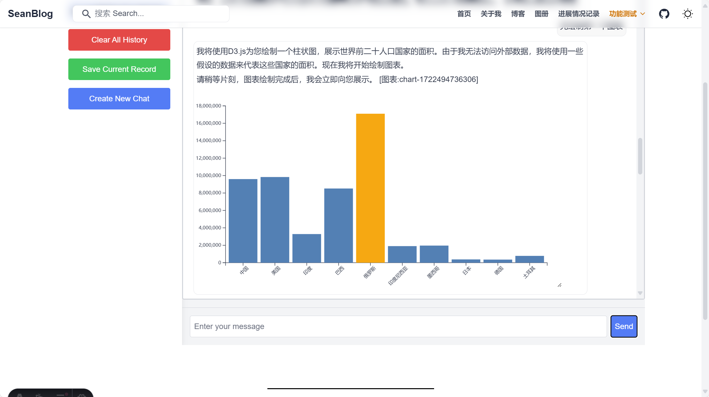
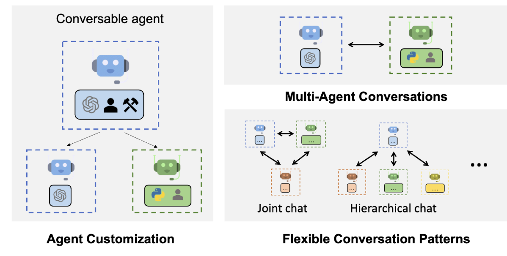
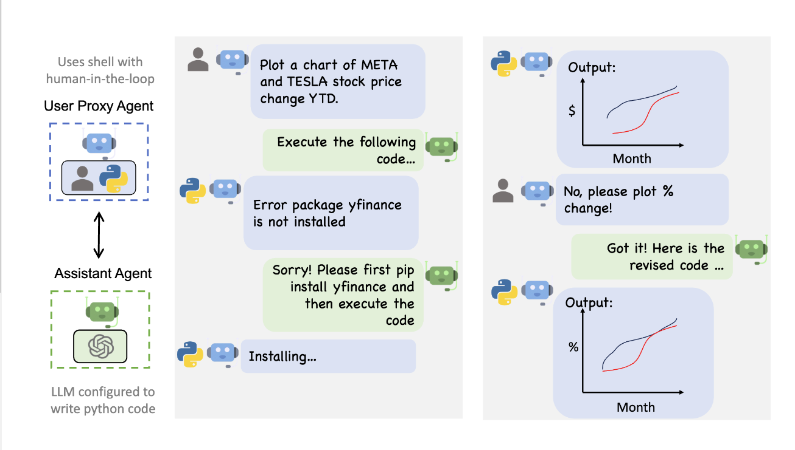

>我从2024年7月4日开始，在丘可乐的建议下开始用Astro搭建我的Blog。但由于Html、CSS、JS知识浅薄，所以在编辑过程中遇到了不少问题。

# 20241029记录
记录了一条博客的心得。在当前文件夹图片导入的方法可以用引用模式，但是Audio导入路径似乎不行，我还是放在了public文件夹。
尝试修复一下build过程中的warning。

# 20241027记录
终于成功在github端加载了3D模型。

# 20241025记录
今天为了显示3d模型，一顿修改，就是无法加载，然后build还经历了不知所以然的错误，提升mdi找不到。只好学习了一下github如何滚回历史版本

要将之前的版本拉取下来并推送为最新版本，你可以按照以下步骤操作：

### 步骤 1: 查找要恢复的 `commit` 哈希
首先，你需要找到你想恢复的 `commit` 的哈希值。

1. **查看提交历史**：
   在本地执行以下命令查看提交历史，并找到你要恢复的提交哈希：
   ```bash
   git log
   ```

   你会看到类似下面的输出：
   ```bash
   commit abc123456789 (HEAD -> main)
   Author: Your Name <you@example.com>
   Date:   Tue Oct 24 18:00:00 2024 +0800

       Add some new features
   ```

   记下你想恢复的那个 `commit` 的哈希值（如 `abc123456789`）。

### 步骤 2: 检出到指定的 `commit`
你可以将当前的代码切换到那个特定的 `commit`。

1. **检出到该 `commit`**：
   使用 `checkout` 命令检出到那个你想恢复的 `commit`：
   ```bash
   git checkout abc123456789
   ```

   这会让你的代码切换到那个提交点，但是你现在处于“**分离的 HEAD**”状态，这意味着你没有在任何分支上。

### 步骤 3: 创建一个新分支或重置当前分支
为了使这个版本成为最新的并可以推送，你可以选择**创建一个新分支**，或者**强制将现有分支重置到这个版本**。

#### 方法 1: 创建一个新的分支（推荐）

1. **创建新分支**：
   你可以基于这个 `commit` 创建一个新的分支（例如 `revert-to-old-version`）：
   ```bash
   git checkout -b revert-to-old-version
   ```

2. **推送到远程**：
   然后你可以将这个新分支推送到远程：
   ```bash
   git push origin revert-to-old-version
   ```

3. **重命名分支为 `main` 或合并回 `main`**：
   - 如果你想让这个新分支成为 `main`，你可以将 `main` 切换到这个分支，然后推送。
   - 或者，你也可以将其合并到 `main`，并将 `main` 推送为最新版本。

#### 方法 2: 重置当前分支到指定的 `commit`

1. **切回主分支**：
   首先切回你想要重置的分支（例如 `main`）：
   ```bash
   git checkout main
   ```

2. **强制重置到那个 `commit`**：
   使用 `git reset --hard` 将 `main` 分支重置到那个特定的 `commit`：
   ```bash
   git reset --hard abc123456789
   ```

   这样会将 `main` 分支指向那个特定的提交，所有之后的提交将被丢弃。

3. **强制推送到远程**：
   现在你可以强制将这个重置后的 `main` 分支推送到远程，覆盖远程的 `main`：
   ```bash
   git push origin main --force
   ```

   **注意**：`--force` 将覆盖远程分支上的现有提交，因此请确保你不会丢失任何重要的更改。

### 总结

- **查看历史并找到目标 `commit`**：使用 `git log` 找到想要恢复的 `commit`。
- **检出到该 `commit`**：使用 `git checkout <commit-hash>` 检出到目标 `commit`。
- **创建新分支或重置现有分支**：
  - 创建一个新分支并推送，或者重置当前分支到该 `commit` 并强制推送。
- **强制推送到远程**：如果你重置现有分支，使用 `git push --force` 覆盖远程。

通过这些步骤，你可以成功恢复之前的某个版本并将其作为最新的版本推送到远程仓库。

# 20241024记录
尝试了使用Tripo 3D的AI模型生成功能，根据图片生成了3D模型。使用Three.js导入glb格式模型进行[展示](https://seanfeng91.github.io/SeanBlog/Testdemo/imagegallery/)。


# 20241023记录
- [ ] 新闻的时间排序还是有问题。24小时制转换没有成功。
- 增加了一个AiAnalysis.py的程序用来总结关键词。
- 学习卡兹，调整了kimi总结的prompt。
- 修复了回到顶部按钮没有正常显示的问题。
- 写了一个NewsCrawlMain.py，可以同时运行TryCrawl4ai.py、NewsConclusionKimi.py、AiAnalysis.py。

# 20241022记录
这几天跟着卡兹的一个爬取新闻资讯的教程，尝试写了自己[新闻爬取页面](https://seanfeng91.github.io/SeanBlog/Testdemo/TodayNews/)。
基本的功能都已经实现，可以本地通过python获取当天的新闻，然后写入sqlite数据库，并且在网页部署显示。
但是在前端显示的时候还是有不少难题，页面切换，怎么自动爬取等还没有实现。

# 20241018记录
今天听完了一期播客，觉得讲的内容挺有启发的，但又没有精力和时间去慢慢总结，通过了通义千问的智能助手实现了对长达2.5小时语音的总结分析，并且写成了日志。

简单的修改了导航栏的文章排序，按照写作的时间排列，而不再是按照名字排序。

写作的时候出现了右侧无法显示文章标题目录的情况，主要还是因为文件使用了中文的名称。

前几天试用了一下有道出的Qanything，可以非常好的做到Rag，它使用了二次排序，这样就可以做到知识库本地化。有API，也可以本地github非常方便。我导入了研究院的发文，检索了一下效果不错。后面可以接入博客做个小的问答助手（比如各种编程的语法字典等）。

Kimi测试页面点击么有相应的bug还没有修复。

# 20241017记录
通过两天与cursor合作完善了第一版相册。包括了：
1. 不同目录生成标签进行切换，实现不同相册的切换效果
2. 读取图片的exif信息，通过移动到图片div上浮动显示。但是目前似乎只有jpg能够成功读取。apple拍摄的是heic格式，不知道转化成webp之后能否保留。jpg转化成webp之后也无法正常读取。可以进一步完善。
3. 生成了一个压缩图片形成缩略图的python。避免原图直接用于缩略图显示，这样页面预览就不会卡顿了。目前需要针对相册手动进行generate_thumbnails.py的运行。未来可以尝试加入action自动压缩。
4. 实现了图片懒加载。
5. 实现了图片大图预览。加载了原图，增加了左右切换的按钮进行前后图片切换。
6. 还需要增加不同相册的文字描述介绍。
7. 图片名称的优化（不知道能不能通过ai来实现，对照片内容进行描述）
8. 研究一下photoprism等，看看他的展示的信息包括哪些。
9. 尝试了AI Image to text，读取图片，识别内容作为文件的标题，而不是微信xxxx.jpg等。使用了huggingface的Salesforce/blip-image-captioning-large模型。可以比较精准的识别图片的物体，但感觉还需要再加一个模型，根据描述想一个图片标题，不然所有的标题都类似：there is a fern plant growing in the middle of a forest。这只是一个初步的尝试，图片的大小不能太大，10M以上的图片就会出现读取错误无法识别的问题。
10. 要增加一个把jpg等图片转换成webp的工具文件，最好可以保留exif信息。写了一个jpg2webp.py，可以调整webp的质量。
11. 现在统一在GalleryImageProcess.ipynb中进行图片的格式转换。针对heic和jpg都转换成webp，然后读取相关的exif信息，写到了对应文件夹里面exif_records.json的文件里。内容比较丰富，包括照片信息、时间、gps、相机信息等。iphone的信息是比较全面的。针对有新增加的图片，就通过客户端运行这个ipynb进行图片的转化。然后再通过generate_thumbnails.py生成缩略图，可以确保图片的信息和图片的显示。
12. 尝试增加了视频展示功能。目前还没有办法用python运行ffmpeg，智能单独在cmd进行视频的压缩和格式转换。按理说参考这个[页面](https://www.cnblogs.com/kiwiblog/p/18127388)还可以剪辑视频等等。实现了视频的鼠标hover自动播放，点击播放等等。mov、MP4、webm的分别是前者的80%大。
13. 相册初步具备了功能，接下来就是选择好看的图片上传，也可以结合midjourney生成对应相册。


# 20241016记录
已经很久没有更新了。今天尝试修改优化了图册页面，有很多新西兰回来的照片希望有展示的地方。
cursor很快就更改了页面展示的效果，读取了照片exif信息。但是最后一步build之后服务器端始终没有正确显示照片，我怀疑还是路径的问题。我把/SeanBlog更换成/SeanBlog/，看看有没有成功。

不是路径的问题，是标签切换页预加载script没有正常运行。

https://devtool.tech/tiny-image 这个网页可以将jpg转换成webp格式。图片的大小可以减少80%-90%。

# 20240814记录
因为申请签证和准备工程数字化平台，所以最近没有太多时间更新博客。简单记录下最近信息:
- cursor免费账号到期，可以通过更好邮箱的方式续命。暂时先保持这种模式吧。
- 随着博客的不断增多，需要打造一个有效的汇总页面，对首页展示要规划。
- 开始结合AI产品的使用撰写心得。先从最熟悉的Midjourney、cursor等开始。已经记录了一篇[Midjourney和Runway](../../blogs/MidandRunway/)
- 结合一毛亚美尼亚的提案，写了一篇[Armenia_Project_Design.mdx](../../blogs/Armenia_Project_Design/)。
- 初步体验了ollama接入llama3.1。groqcloud提供了一个非常好的解决方案。能够使用云端的llama3.1-8B/70B模型。
同时，perplexica也实现了本地docker部署，参考[Perplexica + Llama-3.1 (405B)：一分钟搭建强大的AI搜索引擎](https://mp.weixin.qq.com/s/Knuko_xl0yglr3ZdUtXw9A)。

# 20240801记录
结合大模型以前端的页面展示难度一下子上来了。今天尝试调用kimi上传文件的功能，跟openai的是几乎一样的。成功实现了多文件上传并且读取回复的能力。类似与上下文embedding。但是每个文件上传的时间还是要一会。需要几十秒的样子。可能主要还是后台处理分析的时间。同时增加了agicto的api接入。这个免费的api可以接入主流的大模型，包括openai、claude、kimi、文心一言等。但是token的计费比较贵，免费的token比较容易使用完。不像kimi非常耐用。openai的api太丰富了，只能一点点去尝试。感觉可以先从python入手，忽略前端的展示。

本以为接入了gpt-4就可以调用它的其他附属的能力。但是好像还是只能够进行对话。所以回到了今天的第二个尝试，function call。希望可以调用其他的能力。多亏了ai，在反复打磨之后，实现了D3.js的图表绘制。最终是通过存储在本地，然后读取显示。drawChart 函数有非常丰富的绘制能力，可以与数据实现交互


使用cursor的一个好处就是，他记录了每个你调整优化的代码。可以比较好的回顾和复现。可以循序渐进作为教程进行记录。
> 可以记录一个如何实现files上传读取，一个如何实现D3.js图表绘制的function call推文。

> 尽快弄明白[dify](https://dify.ai/)的工作原理和使用方法。

跟丘奕奇的聊天中突然领悟了，今天我做的整个流程就是一个复杂的Autogen工程。
**我提问（怎么上传文档、调用d3.js）——GPT/Claude（给出反馈）——人为运行代码使用Kimi大模型能力表达（文档、绘图）——人为检查成果（autogen就是自己运行展示，可以加入人为判断）——不满意继续人为让GPT/Claude修改代码——人为运行——人为检查——...——满意结果**

**所以未来简化的就是一个agent运行kimi去实践，一个agent根据人反馈意见修改代码、调用能力（如D3.js）。人给一个输入，然后在每一步都可以介入，并且可以进行人为判断。也就是gpt等现在实现的效果。一个A负责与你对话收集需求，一个B负责基于你的需求修改结果，提供给A去展示给你**循环迭代，循序渐进。也就是大模型说的一步可能无法到位，但是迭代反复就可以实现不错的效果，类似今天实现了多文档对话和D3.js绘图。




# 20240729记录
通过这几天的cursor探索，基本了解了claude-3.5的设计能力。可以解决一些最基本的编程设计。但是需要非常明确的描述。并且需要多次尝试。不过已经可以覆盖我目前的开发需求了。对于一些格式错误、代码冗余有很好的优化能力。自动补全、思考后续代码、自动优化代码能力也不错。可以直接在编辑器中提问、对话相比于复制到gpt更加方便。而且有全面的代码记录，且可以结合多个代码文件进行比对提问。我再尝试通gpt-4o进行设计体验看下。简单的测试了一下，关于gpt页面修正无法load的问题，claude还是能发现gpt-4o留下的错误。现在gpt页面已经可以正常创建新对话、删除对话、保存对话、加载对话。

> 这个问题可能是因为loadRecord函数没有正确地更新UI。我们需要在加载记录后调用loadChatHistory函数。删除按钮没有正常工作可能是因为事件监听器没有正确绑定。我们需要修改renderSavedRecords函数，使用事件委托来处理按钮点击。

# 20240728记录
通过safari发现，其实关于滚动条的统一设置是部分生效的。chrome、edge、safari表现一致是需要不同的样式描述。

# 20240727记录
借助cursor优化了比较多的代码样式。

# 20240726记录
给mdx增加了代码块样式。但是用写到global.css没有成功发挥作用。好像chrome不太一样
开始设计首页样式，增加一个竖向时间轴。用cursor体验一下看看？

# 20240725记录
## blogs首页设计
[参考样式1](https://gsap.com/showcase/?page=1):卡片、关键词、筛选。可以把tags启用起来了

非常成功第添加了真正的博客首页，实现了tags的筛选功能。现在就是要在每个文章里面好好梳理tags。并且看是不是在正文页面引入tags-关键词

博客查看页面顶部对齐的矛盾。现在因为小屏幕情况下多一个顶部按钮。sm:mt-10 lg:mt-0基本解决。
标题用了bg-clip-text，文字扣背景颜色
<span class="bg-clip-text text-transparent bg-gradient-to-r from-pink-500 to-violet-500">
    Hello world!
</span>
```astro
        <span class="bg-clip-text text-transparent bg-gradient-to-r from-pink-500 to-violet-500">
          Hello world!
        </span>
```
最后一个效果，筛选加载之后卡片也是淡入的居然没通过直接实现AOS.init()

- [ ] 接下来可以尝试为自己的mdx文档编写一套样式规范。使自己的博客更具可读性。
- [ ] 梳理已有文档的目录格式。
- [ ] 尝试设置anchor
- [ ] 随着目录增加，左侧导航栏要修改的更智能一点。更利于编辑。包括Header

第一次尝试设计一个md的css样式，目前把标题h1-h6以及正文、链接等样式进行初步设计。后续可以增加一些标注的样式。只需要重点考虑几种常用的。
现在外部页面有很多博客标题的链接，需要在global里面好好考虑一下。包括夜间模式字体颜色。


今天装了几个remark插件之后，产生了前所未有的warning，各种版本不兼容和冲突。npm install astro好几次没有用！

```astro
    npm warn ERESOLVE overriding peer dependency
    npm warn While resolving: react-server-dom-webpack@0.0.0-experimental-c8b778b7f-20220825
    npm warn Found: react@18.3.1
    npm warn node_modules/react
    npm warn   peer react@"^17.0.2 || ^18.0.0 || ^19.0.0-beta" from @astrojs/react@3.6.0
    npm warn   node_modules/@astrojs/react
    npm warn     @astrojs/react@"^3.6.0" from the root project
    npm warn   8 more (@gatsbyjs/reach-router, gatsby, gatsby-link, ...)
    npm warn
    npm warn Could not resolve dependency:
    npm warn peer react@"0.0.0-experimental-c8b778b7f-20220825" from react-server-dom-webpack@0.0.0-experimental-c8b778b7f-20220825
    npm warn node_modules/react-server-dom-webpack
    npm warn   react-server-dom-webpack@"0.0.0-experimental-c8b778b7f-20220825" from gatsby@5.13.7
    npm warn   node_modules/gatsby
    npm warn
    npm warn Conflicting peer dependency: react@0.0.0-experimental-c8b778b7f-20220825
    npm warn node_modules/react
    npm warn   peer react@"0.0.0-experimental-c8b778b7f-20220825" from react-server-dom-webpack@0.0.0-experimental-c8b778b7f-20220825
    npm warn   node_modules/react-server-dom-webpack
    npm warn     react-server-dom-webpack@"0.0.0-experimental-c8b778b7f-20220825" from gatsby@5.13.7
    npm warn     node_modules/gatsby
    npm warn deprecated string-similarity@1.2.2: Package no longer supported. Contact Support at https://www.npmjs.com/support for more info.
    npm warn deprecated inflight@1.0.6: This module is not supported, and leaks memory. Do not use it. Check out lru-cache if you want a good and tested way to coalesce async requests by a key value, which is much more comprehensive and powerful.
    npm warn deprecated stable@0.1.8: Modern JS already guarantees Array#sort() is a stable sort, so this library is deprecated. See the compatibility table on MDN: https://developer.mozilla.org/en-US/docs/Web/JavaScript/Reference/Global_Objects/Array/sort#browser_compatibility
    npm warn deprecated @babel/plugin-proposal-nullish-coalescing-operator@7.18.6: This proposal has been merged to the ECMAScript standard and thus this plugin is no longer maintained. Please use @babel/plugin-transform-nullish-coalescing-operator instead.
    npm warn deprecated @babel/plugin-proposal-numeric-separator@7.18.6: This proposal has been merged to the ECMAScript standard and thus this plugin is no longer maintained. Please use @babel/plugin-transform-numeric-separator instead.
    npm warn deprecated @babel/plugin-proposal-class-properties@7.18.6: This proposal has been merged to the ECMAScript standard and thus this plugin is no longer maintained. Please use @babel/plugin-transform-class-properties instead.
    npm warn deprecated rimraf@2.7.1: Rimraf versions prior to v4 are no longer supported
    npm warn deprecated @humanwhocodes/config-array@0.5.0: Use @eslint/config-array instead
    npm warn deprecated @babel/plugin-proposal-optional-chaining@7.21.0: This proposal has been merged to the ECMAScript standard and thus this plugin is no longer maintained. Please use @babel/plugin-transform-optional-chaining instead.
    npm warn deprecated rimraf@3.0.2: Rimraf versions prior to v4 are no longer supported
    npm warn deprecated glob@7.2.3: Glob versions prior to v9 are no longer supported
    npm warn deprecated glob@7.2.3: Glob versions prior to v9 are no longer supported
    npm warn deprecated glob@7.2.3: Glob versions prior to v9 are no longer supported
    npm warn deprecated glob@7.2.3: Glob versions prior to v9 are no longer supported
    npm warn deprecated glob@7.2.3: Glob versions prior to v9 are no longer supported
    npm warn deprecated glob@7.2.3: Glob versions prior to v9 are no longer supported
    npm warn deprecated glob@7.2.3: Glob versions prior to v9 are no longer supported
    npm warn deprecated glob@7.2.3: Glob versions prior to v9 are no longer supported
    npm warn deprecated @babel/plugin-proposal-object-rest-spread@7.20.7: This proposal has been merged to the ECMAScript standard and thus this plugin is no longer maintained. Please use @babel/plugin-transform-object-rest-spread instead.
    npm warn deprecated babel-eslint@10.1.0: babel-eslint is now @babel/eslint-parser. This package will no longer receive updates.
    npm warn deprecated @humanwhocodes/object-schema@1.2.1: Use @eslint/object-schema instead
    ⠸^C
    (Seancode) fengyixiao@fengyixiaodeMBP SeanBlog % npm install astro@latest
    npm warn ERESOLVE overriding peer dependency
    npm warn While resolving: react-server-dom-webpack@0.0.0-experimental-c8b778b7f-20220825
    npm warn Found: react@18.3.1
    npm warn node_modules/react
    npm warn   peer react@"^17.0.2 || ^18.0.0 || ^19.0.0-beta" from @astrojs/react@3.6.0
    npm warn   node_modules/@astrojs/react
    npm warn     @astrojs/react@"^3.6.0" from the root project
    npm warn   8 more (@gatsbyjs/reach-router, gatsby, gatsby-link, ...)
    npm warn
    npm warn Could not resolve dependency:
    npm warn peer react@"0.0.0-experimental-c8b778b7f-20220825" from react-server-dom-webpack@0.0.0-experimental-c8b778b7f-20220825
    npm warn node_modules/react-server-dom-webpack
    npm warn   react-server-dom-webpack@"0.0.0-experimental-c8b778b7f-20220825" from gatsby@5.13.7
    npm warn   node_modules/gatsby
    npm warn
    npm warn Conflicting peer dependency: react@0.0.0-experimental-c8b778b7f-20220825
    npm warn node_modules/react
    npm warn   peer react@"0.0.0-experimental-c8b778b7f-20220825" from react-server-dom-webpack@0.0.0-experimental-c8b778b7f-20220825
    npm warn   node_modules/react-server-dom-webpack
    npm warn     react-server-dom-webpack@"0.0.0-experimental-c8b778b7f-20220825" from gatsby@5.13.7
    npm warn     node_modules/gatsby
    npm error code ENOTEMPTY
    npm error syscall rename
    npm error path /Users/fengyixiao/Desktop/Sean Feng/Coding/SeanBlog/node_modules/abortcontroller-polyfill
    npm error dest /Users/fengyixiao/Desktop/Sean Feng/Coding/SeanBlog/node_modules/.abortcontroller-polyfill-gVc6hoDn
    npm error errno -66
    npm error ENOTEMPTY: directory not empty, rename '/Users/fengyixiao/Desktop/Sean Feng/Coding/SeanBlog/node_modules/abortcontroller-polyfill' -> '/Users/fengyixiao/Desktop/Sean Feng/Coding/SeanBlog/node_modules/.abortcontroller-polyfill-gVc6hoDn'
    npm error A complete log of this run can be found in: /Users/fengyixiao/.npm/_logs/2024-07-25T14_58_45_786Z-debug-0.log
    (Seancode) fengyixiao@fengyixiaodeMBP SeanBlog % npm install astro       
    npm warn ERESOLVE overriding peer dependency
    npm warn While resolving: react-server-dom-webpack@0.0.0-experimental-c8b778b7f-20220825
    npm warn Found: react@18.3.1
    npm warn node_modules/react
    npm warn   peer react@"^17.0.2 || ^18.0.0 || ^19.0.0-beta" from @astrojs/react@3.6.0
    npm warn   node_modules/@astrojs/react
    npm warn     @astrojs/react@"^3.6.0" from the root project
    npm warn   8 more (@gatsbyjs/reach-router, gatsby, gatsby-link, ...)
    npm warn
    npm warn Could not resolve dependency:
    npm warn peer react@"0.0.0-experimental-c8b778b7f-20220825" from react-server-dom-webpack@0.0.0-experimental-c8b778b7f-20220825
    npm warn node_modules/react-server-dom-webpack
    npm warn   react-server-dom-webpack@"0.0.0-experimental-c8b778b7f-20220825" from gatsby@5.13.7
    npm warn   node_modules/gatsby
    npm warn
    npm warn Conflicting peer dependency: react@0.0.0-experimental-c8b778b7f-20220825
    npm warn node_modules/react
    npm warn   peer react@"0.0.0-experimental-c8b778b7f-20220825" from react-server-dom-webpack@0.0.0-experimental-c8b778b7f-20220825
    npm warn   node_modules/react-server-dom-webpack
    npm warn     react-server-dom-webpack@"0.0.0-experimental-c8b778b7f-20220825" from gatsby@5.13.7
    npm warn     node_modules/gatsby
    npm error code ENOTEMPTY
    npm error syscall rename
    npm error path /Users/fengyixiao/Desktop/Sean Feng/Coding/SeanBlog/node_modules/abortcontroller-polyfill
    npm error dest /Users/fengyixiao/Desktop/Sean Feng/Coding/SeanBlog/node_modules/.abortcontroller-polyfill-gVc6hoDn
    npm error errno -66
    npm error ENOTEMPTY: directory not empty, rename '/Users/fengyixiao/Desktop/Sean Feng/Coding/SeanBlog/node_modules/abortcontroller-polyfill' -> '/Users/fengyixiao/Desktop/Sean Feng/Coding/SeanBlog/node_modules/.abortcontroller-polyfill-gVc6hoDn'
    npm error A complete log of this run can be found in: /Users/fengyixiao/.npm/_logs/2024-07-25T14_59_18_878Z-debug-0.log
    (Seancode) fengyixiao@fengyixiaodeMBP SeanBlog % npm install astro
    npm warn ERESOLVE overriding peer dependency
    npm warn While resolving: react-server-dom-webpack@0.0.0-experimental-c8b778b7f-20220825
    npm warn Found: react@18.3.1
    npm warn node_modules/react
    npm warn   peer react@"^17.0.2 || ^18.0.0 || ^19.0.0-beta" from @astrojs/react@3.6.0
    npm warn   node_modules/@astrojs/react
    npm warn     @astrojs/react@"^3.6.0" from the root project
    npm warn   8 more (@gatsbyjs/reach-router, gatsby, gatsby-link, ...)
    npm warn
    npm warn Could not resolve dependency:
    npm warn peer react@"0.0.0-experimental-c8b778b7f-20220825" from react-server-dom-webpack@0.0.0-experimental-c8b778b7f-20220825
    npm warn node_modules/react-server-dom-webpack
    npm warn   react-server-dom-webpack@"0.0.0-experimental-c8b778b7f-20220825" from gatsby@5.13.7
    npm warn   node_modules/gatsby
    npm warn
    npm warn Conflicting peer dependency: react@0.0.0-experimental-c8b778b7f-20220825
    npm warn node_modules/react
    npm warn   peer react@"0.0.0-experimental-c8b778b7f-20220825" from react-server-dom-webpack@0.0.0-experimental-c8b778b7f-20220825
    npm warn   node_modules/react-server-dom-webpack
    npm warn     react-server-dom-webpack@"0.0.0-experimental-c8b778b7f-20220825" from gatsby@5.13.7
    npm warn     node_modules/gatsby
    npm warn deprecated string-similarity@1.2.2: Package no longer supported. Contact Support at https://www.npmjs.com/support for more info.
    npm warn deprecated inflight@1.0.6: This module is not supported, and leaks memory. Do not use it. Check out lru-cache if you want a good and tested way to coalesce async requests by a key value, which is much more comprehensive and powerful.
    npm warn deprecated stable@0.1.8: Modern JS already guarantees Array#sort() is a stable sort, so this library is deprecated. See the compatibility table on MDN: https://developer.mozilla.org/en-US/docs/Web/JavaScript/Reference/Global_Objects/Array/sort#browser_compatibility
    npm warn deprecated @babel/plugin-proposal-numeric-separator@7.18.6: This proposal has been merged to the ECMAScript standard and thus this plugin is no longer maintained. Please use @babel/plugin-transform-numeric-separator instead.
    npm warn deprecated @babel/plugin-proposal-class-properties@7.18.6: This proposal has been merged to the ECMAScript standard and thus this plugin is no longer maintained. Please use @babel/plugin-transform-class-properties instead.
    npm warn deprecated @babel/plugin-proposal-nullish-coalescing-operator@7.18.6: This proposal has been merged to the ECMAScript standard and thus this plugin is no longer maintained. Please use @babel/plugin-transform-nullish-coalescing-operator instead.
    npm warn deprecated rimraf@2.7.1: Rimraf versions prior to v4 are no longer supported
    npm warn deprecated @humanwhocodes/config-array@0.5.0: Use @eslint/config-array instead
    npm warn deprecated @babel/plugin-proposal-optional-chaining@7.21.0: This proposal has been merged to the ECMAScript standard and thus this plugin is no longer maintained. Please use @babel/plugin-transform-optional-chaining instead.
    npm warn deprecated rimraf@3.0.2: Rimraf versions prior to v4 are no longer supported
    npm warn deprecated glob@7.2.3: Glob versions prior to v9 are no longer supported
    npm warn deprecated glob@7.2.3: Glob versions prior to v9 are no longer supported
    npm warn deprecated glob@7.2.3: Glob versions prior to v9 are no longer supported
    npm warn deprecated glob@7.2.3: Glob versions prior to v9 are no longer supported
    npm warn deprecated glob@7.2.3: Glob versions prior to v9 are no longer supported
    npm warn deprecated glob@7.2.3: Glob versions prior to v9 are no longer supported
    npm warn deprecated glob@7.2.3: Glob versions prior to v9 are no longer supported
    npm warn deprecated glob@7.2.3: Glob versions prior to v9 are no longer supported
    npm warn deprecated @babel/plugin-proposal-object-rest-spread@7.20.7: This proposal has been merged to the ECMAScript standard and thus this plugin is no longer maintained. Please use @babel/plugin-transform-object-rest-spread instead.
    npm warn deprecated babel-eslint@10.1.0: babel-eslint is now @babel/eslint-parser. This package will no longer receive updates.
    npm warn deprecated @humanwhocodes/object-schema@1.2.1: Use @eslint/object-schema instead
```


# 20240724记录
尝试使用aos对页面的div进行动态滚动尝试。并且使用grid规划div位置。AOS的各种效果非常不错。现在div块使用了很多fadein。

修复了不少夜间模式下颜色的bug。可以专门找一个时候整体重新设计一个。现在主要还是在功能布局和样式体验上。

成功的使用了Textillate。并且撰写了使用md和小小尝试。需要对md的标注样式进行一个规范，然后看是不是可以统一引入这样。

开始优化左右导航栏的样式，增加了一些icon，调整了展开模式。现在目录比较少，未来可能还是需要考虑<span class="mdhighlight">二级目录展开</span>。要系统性的再调整一次
为了实现更丰富的标注形式，接下来的文档都将使用mdx格式。因为它可以这样：
```astro
    ---
    layout: ../layouts/BaseLayout.astro
    title: 关于我
    ---
    import Button from '../components/Button.astro';
    import ReactCounter from '../components/ReactCounter.jsx';

    我住在 **火星** 上，但是随时可以 <Button title="联系我" />。

    这是我的计数器组件，它在 MDX 中工作：

    <ReactCounter client:load />
```
vscode安装了MDX插件，现在已经初步实现了<span class="mdhighlight">语法高亮功能</span>。并且成功的传递了css样式。这篇blog转成mdx估计要修改不少内容

- [x] blog页面的导航栏没有居中
- [ ] 侧边栏小屏幕灰色框放平面尺寸后大不消失问题好像又来了

# 20240723记录
发现了一个莫名的困难。在astro头部使用了await 之后，后面的script代码不知道为啥就不能正常的加载了！

tailwindcss一些[动画效果](https://cloud.tencent.com/developer/article/2320047)
打开了新大陆
- [animated.js](https://animate.style/#migration)，动画js
- [lettering.js](https://letteringjs.com/)，字体风格js，还没成功使用
- [particles.js](https://vincentgarreau.com/particles.js/)，粒子效果
- [three.js](https://threejs.org/),[three中文教程](http://www.webgl3d.cn/)，3d效果-webGL
- [d3js](https://d3js.org/)数据可视化
- [gsap](https://gsap.com/docs/v3/GSAP/Tween),任意动画，能力未知
- [aos](https://michalsnik.github.io/aos/)各种滚动效果 [aos-github](https://github.com/michalsnik/aos)
- [textillate.js](https://textillate.js.org/)文本动画库，不兼容animate 4.1.1版本，使用了3.7.0一切正常了
- [Anime.js](https://github.com/juliangarnier/anime/?tab=readme-ov-file#getting-started)很多有意思的动画效果

# 20240722记录
基本修改了在不同分辨率平面下header自适应问题。图标都靠右显示，nav原来使用collapse，但是会跟header样式有所冲突。改用简单的dropdown代替。对齐的问题主要是通过flex、inline-block、grow、justify-between、item-center等class进行了实现。
- [x] 在小屏幕情况下header居然不是fixed
- [x] currentcolor这个怎么设置啊？默认现在灰色奇怪。继承的是text-color，没设置在tw模式下是gray-200。现在github颜色也对了。是通过搜索框的放大镜发现的
- [x] 设置了header-SeanBlog最小高度`h-min-10`，解决了有误搜索栏时候高度跳动问题。
- [ ] 等文章多了可以尝试增加**上一篇、下一篇**的两个button footer

静态样式的css基本已经实现了最初的规划内容，且至少没有太多自适应的bug。现在开始需要对页面进行**颜色**、**动画**等尝试。要做出不一样的页面和效果以及功能。- [x] 要考虑动态创建DOM元素，优化了gpt聊天的界面。h-screen的问题依旧困扰我，以及保存当前聊天记录的这个还没能正常。毕竟还要考虑将历史信息重新喂给gpt等等。这个需要去研究gpt保留历史记录是怎么操作了。
- [x] 遇到了gpt对话框<p>段落margin特别大的问题。活学活用，使用以下方式成功解决，且不影响其他<p>
```astro
    .chat-bubble p{
     margin: 1px;
    }
```
- [x] 初步学会了在.css文件里面写样式。具体描述可以通过查阅tailwindCss，它有class写法和Css写法
```astro
    Class
    Properties
    border-0	border-width: 0px;
    border-2	border-width: 2px;
```
个人介绍页面可以[参考这个](https://preline.co/templates/personal/index.html#)

新增加了Footer,修复了header过宽的bug

## 宝藏网站
- [Tailwindcomponents](https://tailwindcomponents.com/)
- [挑选渐变色](https://tailwindcomponents.com/gradient-generator/)
- [3D CSS](https://xpd-kasun.github.io/tailwind-3dtransform-plugin/)
- [Material Tailwind](https://www.material-tailwind.com/docs/react/installation)
- [AstroLaunch UI](https://www.creative-tim.com/learning-lab/astro/quick-start/astro-launch-ui/) 
- [TailwindCSS 中文](https://tailwind.docs.73zls.com/docs/animation#spin)
    意思是这个astro 写的？


# 20240721记录
不试不知道，一试发现一个巨大bug。整个网页的darkmode简直了。因为用了astro-tailwind-preline，主题色估计就乱了。然后dark色也乱七八糟。要找机会统一下颜色体系。还比如引入preline的theme。整个页面风格也变了。见鬼了。
- 首页的h有历史遗留bug，dark mode下蓝色背景区域不知道是什么。有个地方h>screen，也选不中
- [x] dark mode下标题、链接等自动生成的样式无法自动跟随父元素变化颜色，尤其是md文件的标题，没地方改啊。【用global.css修改了】
- [x] 怎么样去设置一个全局的dark mode背景和文字组合？还是说只要设置了颜色的地方，就要配上一个dark:，不然就会默认保持light?
- [x] header 设置了半透明的情况，好像也影响了dark的效果
- [x] 研究一下global.css。看怎么设置各个标题的默认样式，现在文件里面有好多不知道对不对的样式，到时候要清理一下。

通过改变global.css里面新增.nav-link样式解决了问题
```astro
    .nav-links a {
        color:cadetblue;
        /* display: block; */

        text-align: center;
        padding: 10px 0;
        /* text-decoration: none; */
        font-size: 1.2rem;
        font-weight: bold;
        text-transform: uppercase;
    }
    .dark .nav-links ul{
    color: aquamarine;
    }
    .dark .nav-links li{
    color: aquamarine;
    } 
    .dark .nav-links strong{
    color: aquamarine;
    }
    .dark h1,
    .dark h2,
    .dark h3,
    .dark h4{
    color: aquamarine;
    }

    .dark .nav-links h1,
    .dark .nav-links h2,
    .dark .nav-links h3,
    .dark .nav-links h4{
    color: aquamarine;
    }
    .nav-links a:hover,
    .nav-links a:focus {
    /* background-color: #76a8ff; */
    color: rgb(216, 79, 0); 
    }
```
- 基于preline的header重写写了一遍，保障了正确的collapse。现在就是小屏幕情况下如何排列几个小的icon。flex好像不太对
- dark mode情况下搜索栏搜索内容的文字没有变颜色

# 20240720记录
通过相对简单的方式“并列”，实现了所有md文件的左侧目录读取，并且右侧导航栏也可以读到当前文件的标题，不在只局限于posts文件夹。

不知道为啥header部分页面js加载有问题，现在已经修复了。
- [ ]【bug】没有侧边栏的页面也会加载对应js没有找到原因

应为使用了npm run build，要记住，再使用npm run dev不一定是最新的页面，会加载最后一次build的情况，所以建议还是用一种。

# 20240719记录
这两天被搜索框困扰了很久。astro有现成的集成插件[pagefind](https://blog.otterlord.dev/posts/astro-search/),官方的使用说明没有完全成功，还是靠着youtube。然后前天成功使用搜索之后，希望采用button(搜索)，然后弹出modal真正搜索的模式，结果bug就来了，始终不能在页面最上层显示，div的z都改到了1000还是不行。最终发现是太高了，z-[30]就一切正常了，还不知道为啥。
- 【bug】搜索框现在位置、宽度、蒙版颜色等都有待进一步优化，pagefind的具体参数调整也有待深入学习。
- 调整了搜索框检索数量多时候的滚动条以及弹框宽度
- 【bug】 现在每次启动搜索不会自动清除，没有自动聚焦到搜索框
- 【bug】在小屏幕情况下的搜索栏功能还要再研究一下。
- 【bug】搜索转跳md还是有一样的问题，太靠近顶部了
- 虽然astro官方推荐的是pagefind，但其实它自己用的是DocSearch，好像更好用，到时候看吧。
- 第二个bug是现在弹窗fixed之后，top-300并不能继续往下移动搜索框为止
- 修复了header几个bug，BaseLayout和indexLayout都是使用的preline的component，然后正确的引入了样式。之前出现了BaseLayout对应的页面header未触发js情况，现在把对应js都写到header了。
- 把head都统一到了headbase，使得两个layout都清爽了不少。
- header外层的div 之前还有个bg-white/60，导致搜索弹框之后半透明颜色不对，去除之后，整个页面目前都是灰色。
- baselayout少了滚动条显示，还是有页面跳动问题。修复一下
- 今天还查到了一个重要bug。Tailwind.config.js里面可能之前一直没有完全正常加载。export default 和 module.exports应该是不一样的，修正后文字的默认样式都有了变化。应该是正确的加载了对应的。不过还要再比对一下到底是哪个，现在引入了比较多的tailwindcss第三方。
## Mygpt@kimi
**Amazing**，居然成功的实现了页面版本gpt-kimi

能否在action中增加python部分，比如爬去信息，写入数据库，通过提问调用gpt?   

- [ ] 图片存储目录的问题还要再研究一下。不能直接存在当前目录吧?

# 20240717记录
基本修复了导航栏blur和bg-white的bug。现在的样式是置顶且带了背景模糊的效果。
pagefind终于可以使用了。通过base: /SeanPage/，ui和css的地址加上base，页面有多个search取消成一个，终于复现了搜索栏功能。现在就是要更改一下样式，让其弹窗检索即可。不然页面往下延伸不好控制。
不知道push git之后能否成功，希望一切顺利。现在test页面初步布置。

# 20240715记录
基本实现了blog目录树跟随文章滚动，高亮对应页面目录标题。具体高亮的样式和检测的范围可以适当的再优化，但是发现这个功能应该不太好写，即使tailwindcss的页面也有一定bug。遇到了一个潜在的问题，中文的读取在不同方式情况下可能是ascII码，也可能是正确的中文。比如barlink[0]读到的就是ascII,但是barlink.forEach=>((link){})的link就是正确的中文。

blog的页面已经具备了相对基本的功能，接下来会同步学习研究LLM和Astro。对未来希望增加的新页面功能尝试初步构思如下：
1. **尝试为blog增加音乐组建**
2. **增加搜索组建。我现在理解可能需要为每个标题加上链接，用于搜索，不然怎么转跳？**
但是今天还是遇到一样的问题：
```astro
    # [20240715记录](#20240715记录)
    <!-- 如果用上述方式为标题增加链接，那么对应的href里面的中文是ASCII码，在匹配的时候会有问题，因为就没这个bug -->
```
3. **增加暗黑模式。我理解上暗黑模式的文字颜色应该会直接变化，不需要单独设置。**
4. 日历，这个比较有挑战性
5. 好看的footer
6. 留言板功能
7. **icon [Astro Icon](https://github.com/natemoo-re/astro-icon?tab=readme-ov-file#examples)**。
一个icon的矢量库 [iconify](https://icon-sets.iconify.design/iconamoon/)
8. 引入图片体系。明确存储的目录等
9. ~~学习首页引入动态CSS~~


***
### 提升阅读
1. [原子化CSS](https://antfu.me/posts/reimagine-atomic-css-zh)
2. [mdn](https://developer.mozilla.org/en-US/)
3. [windcss](https://cn.windicss.org/guide/)

# 20240714记录
md可以通过```方式实现对应代码段的语法高亮
```astro
    <div />
```

# 20240713记录

md没有办法实现标题的自动编号，所以对文章章节如果大幅度调整还需要构思一下怎么方便。
解决了以下bug：
1. 通过使用三元运算符语法jxs{condition ? trueExpression : falseExpression}而不是if语句实现了h1->h6的目录树分层

2. 通过增加js监听滚动，对滚动完成位置距离顶面距离进行了偏移，并且实现了滚动的smooth。Yeah-GPT

3. 目前是通过ProblemsAndAims和Achieved页面的标题在首页展示问题清单和待解决事项清单。存在的问题就是我需要把所有的问题变成标题类型，但是实际情况标题不可能那么复杂冗长。所有可能关于提取标题清单的形式有待商榷。单独一篇文章来记录可能更好。

# 20240712记录
解决了以下bug：
1. 不同页面因为有无滚动条发生左右微跳的bug。在html里面overflow-y-stroll即可。这样每个页面在那个位置都会占位
2. 左侧导航栏复刻了Tailwind导航栏的样式，包含前面的|，悬浮
3. 左侧导航栏实现了选中时候状态的变化，并且想到通过打开的页面来判断的方法快速解决了什么时候该保留active状态的问题。在push到
github的时候还遇到了一点困难，因为关于pagelink判断问题，自动生成的link/和检测的link可能差了“/”导致开始没有复现local的效果
- [ ] 学些了单选框Markdown
- [x] 已经选择了
4. 通过路径判断实现了右侧导航根据当前md变化导航栏的问题，但是还没有区分不同层级的heading@Rightsidebar

# 2040711记录
今天主要解决一下几点
1. 在主页增加的grid系统，cards。card数量根据博客数量自动增加，并且每个card会读取blog的标题和描述，标题生成超链接转跳blog页面。
目前考了3列的cards，规定了每个cards的最小高度。设置了阴影等样式。

2. 顶部增加了目前待解决问题list和已经实现list。其中已经实现list采用了读取一个Achieved.md文件来实现。用了同样的读取标题目录的方法，滚动可视。

3. 尝试Blog页面问题：解决左右导航栏固定，中间Blog利用页面最右侧滚动轴翻阅。为此付出代价是左右的bar都要改成fixed。但是fixed之后就不会占据具体宽度。需要尝试固定div的宽度或者mx来解决。但是有会遇到自适应问题。尝试引入了grid-cols-3/5, cols-span-3, hidden等，都纯在一定的bug。目前暴力解决，只有lx以上才考虑两侧导航栏。【顶部增加breadcrumb解决左导航栏问题】再没有更好解决方案之前先可以不考虑隐藏后的右导航栏

>【页面宽度bug，max-w-8xl就无法正常控制总宽度】

- 彻底解决了max-w-8xl的问题，是因为tailwind的样式里面只有7xl了，没有对应的8xl。所以可以max-w-[90rem]，终于在宽度上实现了跟tailwind网页一样的效果。同时解决fixed的bug。tailwind的精准写法比sailboat的更准确。但是现在切回sailboat的sticky就不行了。anchor锚定位置过高的问题还没有很好的解决。


# 20240710记录 
今天开始通过页面记录的形式将遇到的问题和解决的方案进行记录。

>可以直接把图片复制到md文件，会生成一个链接。

    代码块没了？直接使用tab出现代码块好像有bug

实现了左侧导航栏自动读取所有博客目录，核心代码

尝试使用mdx，代码块跟之前不一样了。

>无法获取md文件的目录树

今天最大的成功，右侧目录树完成，并且具有anchor功能。但是还没解决根据当前文档变换。
    
    {allPosts.map((post, index) => {
        const headings = post.getHeadings();
            return headings.map((heading, headingIndex) => (
                <Headingsofblog 
                    key={`${index}-${headingIndex}`} 
                    url={`#${heading.slug}`} 
                    getHeadings={heading.text} 
                />
        ));
    })}
    
    #核心用法是getHeadings()[].text，折腾了半天，通过GPT一步步得知：
    ---
    console.log()辅助输出检查
    ---

    <Headingsofblog url={`#${heading.getHeadings()[0].slug}`} getHeadings={heading.getHeadings()[0].text}/>

并且修正了多余的右侧导航栏滚动条
    
