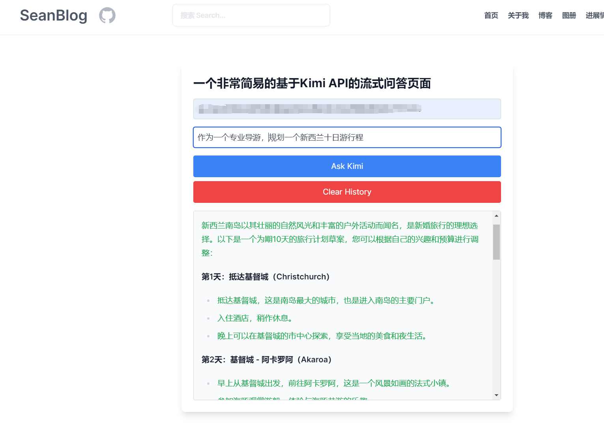

>我从2024年7月4日开始，在丘可乐的建议下开始用Astro搭建我的Blog。但由于Html、CSS、JS知识浅薄，所以在编辑过程中遇到了不少问题。
>居然有AI写作功能！
# MarkDown语法支持
简单的检索了以下三个网页，可以查询丰富的Markdown语法使用。
mdx和md的语法不一样，需要再补充一下mdx的语法
[markdown](https://markdown.p2hp.com/basic-syntax/index.html)
[约翰·格鲁伯设计文档中概述的Markdown元素-Markdown基本语法](https://markdown.p2hp.com/basic-syntax/index.html)
[Markdown 语法指南 (Basic Syntax)](https://zhuanlan.zhihu.com/p/668256808)

# 20240722记录
基本修改了在不同分辨率平面下header自适应问题。图标都靠右显示，nav原来使用collapse，但是会跟header样式有所冲突。改用简单的dropdown代替。对齐的问题主要是通过flex、inline-block、grow、justify-between、item-center等class进行了实现。
- [x] 在小屏幕情况下header居然不是fixed
- [x] currentcolor这个怎么设置啊？默认现在灰色奇怪。继承的是text-color，没设置在tw模式下是gray-200。现在github颜色也对了。是通过搜索框的放大镜发现的
- [x] 设置了header-SeanBlog最小高度`h-min-10`，解决了有误搜索栏时候高度跳动问题。
- [ ] 等文章多了可以尝试增加**上一篇、下一篇**的两个button footer

静态样式的css基本已经实现了最初的规划内容，且至少没有太多自适应的bug。现在开始需要对页面进行**颜色**、**动画**等尝试。要做出不一样的页面和效果以及功能。- [x] 要考虑动态创建DOM元素，优化了gpt聊天的界面。h-screen的问题依旧困扰我，以及保存当前聊天记录的这个还没能正常。毕竟还要考虑将历史信息重新喂给gpt等等。这个需要去研究gpt保留历史记录是怎么操作了。
- [x] 遇到了gpt对话框<p>段落margin特别大的问题。活学活用，使用以下方式成功解决，且不影响其他<p>
```astro
    .chat-bubble p{
     margin: 1px;
    }
```
- [x] 初步学会了在.css文件里面写样式。具体描述可以通过查阅tailwindCss，它有class写法和Css写法
```astro
    Class
    Properties
    border-0	border-width: 0px;
    border-2	border-width: 2px;
```

# 20240721记录
不试不知道，一试发现一个巨大bug。整个网页的darkmode简直了。因为用了astro-tailwind-preline，主题色估计就乱了。然后dark色也乱七八糟。要找机会统一下颜色体系。还比如引入preline的theme。整个页面风格也变了。见鬼了。
- 首页的h有历史遗留bug，dark mode下蓝色背景区域不知道是什么。有个地方h>screen，也选不中
- [x] dark mode下标题、链接等自动生成的样式无法自动跟随父元素变化颜色，尤其是md文件的标题，没地方改啊。【用global.css修改了】
- [x] 怎么样去设置一个全局的dark mode背景和文字组合？还是说只要设置了颜色的地方，就要配上一个dark:，不然就会默认保持light?
- [x] header 设置了半透明的情况，好像也影响了dark的效果
- [x] 研究一下global.css。看怎么设置各个标题的默认样式，现在文件里面有好多不知道对不对的样式，到时候要清理一下。

通过改变global.css里面新增.nav-link样式解决了问题
```astro
    .nav-links a {
        color:cadetblue;
        /* display: block; */

        text-align: center;
        padding: 10px 0;
        /* text-decoration: none; */
        font-size: 1.2rem;
        font-weight: bold;
        text-transform: uppercase;
    }
    .dark .nav-links ul{
    color: aquamarine;
    }
    .dark .nav-links li{
    color: aquamarine;
    } 
    .dark .nav-links strong{
    color: aquamarine;
    }
    .dark h1,
    .dark h2,
    .dark h3,
    .dark h4{
    color: aquamarine;
    }

    .dark .nav-links h1,
    .dark .nav-links h2,
    .dark .nav-links h3,
    .dark .nav-links h4{
    color: aquamarine;
    }
    .nav-links a:hover,
    .nav-links a:focus {
    /* background-color: #76a8ff; */
    color: rgb(216, 79, 0); 
    }
```
- 基于preline的header重写写了一遍，保障了正确的collapse。现在就是小屏幕情况下如何排列几个小的icon。flex好像不太对
- dark mode情况下搜索栏搜索内容的文字没有变颜色

# 20240720记录
通过相对简单的方式“并列”，实现了所有md文件的左侧目录读取，并且右侧导航栏也可以读到当前文件的标题，不在只局限于posts文件夹。

不知道为啥header部分页面js加载有问题，现在已经修复了。
- [ ]【bug】没有侧边栏的页面也会加载对应js没有找到原因

应为使用了npm run build，要记住，再使用npm run dev不一定是最新的页面，会加载最后一次build的情况，所以建议还是用一种。

# 20240719记录
这两天被搜索框困扰了很久。astro有现成的集成插件[pagefind](https://blog.otterlord.dev/posts/astro-search/),官方的使用说明没有完全成功，还是靠着youtube。然后前天成功使用搜索之后，希望采用button(搜索)，然后弹出modal真正搜索的模式，结果bug就来了，始终不能在页面最上层显示，div的z都改到了1000还是不行。最终发现是太高了，z-[30]就一切正常了，还不知道为啥。
- 【bug】搜索框现在位置、宽度、蒙版颜色等都有待进一步优化，pagefind的具体参数调整也有待深入学习。
- 调整了搜索框检索数量多时候的滚动条以及弹框宽度
- 【bug】 现在每次启动搜索不会自动清除，没有自动聚焦到搜索框
- 【bug】在小屏幕情况下的搜索栏功能还要再研究一下。
- 【bug】搜索转跳md还是有一样的问题，太靠近顶部了
- 虽然astro官方推荐的是pagefind，但其实它自己用的是DocSearch，好像更好用，到时候看吧。
- 第二个bug是现在弹窗fixed之后，top-300并不能继续往下移动搜索框为止
- 修复了header几个bug，BaseLayout和indexLayout都是使用的preline的component，然后正确的引入了样式。之前出现了BaseLayout对应的页面header未触发js情况，现在把对应js都写到header了。
- 把head都统一到了headbase，使得两个layout都清爽了不少。
- header外层的div 之前还有个bg-white/60，导致搜索弹框之后半透明颜色不对，去除之后，整个页面目前都是灰色。
- baselayout少了滚动条显示，还是有页面跳动问题。修复一下
- 今天还查到了一个重要bug。Tailwind.config.js里面可能之前一直没有完全正常加载。export default 和 module.exports应该是不一样的，修正后文字的默认样式都有了变化。应该是正确的加载了对应的。不过还要再比对一下到底是哪个，现在引入了比较多的tailwindcss第三方。
## Mygpt@kimi
**Amazing**，居然成功的实现了页面版本gpt-kimi

能否在action中增加python部分，比如爬去信息，写入数据库，通过提问调用gpt?   

- [ ] 图片存储目录的问题还要再研究一下。不能直接存在当前目录吧?

# 20240717记录
基本修复了导航栏blur和bg-white的bug。现在的样式是置顶且带了背景模糊的效果。
pagefind终于可以使用了。通过base: /SeanPage/，ui和css的地址加上base，页面有多个search取消成一个，终于复现了搜索栏功能。现在就是要更改一下样式，让其弹窗检索即可。不然页面往下延伸不好控制。
不知道push git之后能否成功，希望一切顺利。现在test页面初步布置。

# 20240715记录
基本实现了blog目录树跟随文章滚动，高亮对应页面目录标题。具体高亮的样式和检测的范围可以适当的再优化，但是发现这个功能应该不太好写，即使tailwindcss的页面也有一定bug。遇到了一个潜在的问题，中文的读取在不同方式情况下可能是ascII码，也可能是正确的中文。比如barlink[0]读到的就是ascII,但是barlink.forEach=>((link){})的link就是正确的中文。

blog的页面已经具备了相对基本的功能，接下来会同步学习研究LLM和Astro。对未来希望增加的新页面功能尝试初步构思如下：
1. **尝试为blog增加音乐组建**
2. **增加搜索组建。我现在理解可能需要为每个标题加上链接，用于搜索，不然怎么转跳？**
但是今天还是遇到一样的问题：
```astro
    # [20240715记录](#20240715记录)
    <!-- 如果用上述方式为标题增加链接，那么对应的href里面的中文是ASCII码，在匹配的时候会有问题，因为就没这个bug -->
```
3. **增加暗黑模式。我理解上暗黑模式的文字颜色应该会直接变化，不需要单独设置。**
4. 日历，这个比较有挑战性
5. 好看的footer
6. 留言板功能
7. **icon [Astro Icon](https://github.com/natemoo-re/astro-icon?tab=readme-ov-file#examples)**。
一个icon的矢量库 [iconify](https://icon-sets.iconify.design/iconamoon/)
8. 引入图片体系。明确存储的目录等
9. ~~学习首页引入动态CSS~~


***
### 提升阅读
1. [原子化CSS](https://antfu.me/posts/reimagine-atomic-css-zh)
2. [mdn](https://developer.mozilla.org/en-US/)
3. [windcss](https://cn.windicss.org/guide/)

# 20240714记录
md可以通过```方式实现对应代码段的语法高亮
```astro
    <div />
```

# 20240713记录

md没有办法实现标题的自动编号，所以对文章章节如果大幅度调整还需要构思一下怎么方便。
解决了以下bug：
1. 通过使用三元运算符语法jxs{condition ? trueExpression : falseExpression}而不是if语句实现了h1->h6的目录树分层

2. 通过增加js监听滚动，对滚动完成位置距离顶面距离进行了偏移，并且实现了滚动的smooth。Yeah-GPT

3. 目前是通过ProblemsAndAims和Achieved页面的标题在首页展示问题清单和待解决事项清单。存在的问题就是我需要把所有的问题变成标题类型，但是实际情况标题不可能那么复杂冗长。所有可能关于提取标题清单的形式有待商榷。单独一篇文章来记录可能更好。

# 20240712记录
解决了以下bug：
1. 不同页面因为有无滚动条发生左右微跳的bug。在html里面overflow-y-stroll即可。这样每个页面在那个位置都会占位
2. 左侧导航栏复刻了Tailwind导航栏的样式，包含前面的|，悬浮
3. 左侧导航栏实现了选中时候状态的变化，并且想到通过打开的页面来判断的方法快速解决了什么时候该保留active状态的问题。在push到
github的时候还遇到了一点困难，因为关于pagelink判断问题，自动生成的link/和检测的link可能差了“/”导致开始没有复现local的效果
- [ ] 学些了单选框Markdown
- [x] 已经选择了
4. 通过路径判断实现了右侧导航根据当前md变化导航栏的问题，但是还没有区分不同层级的heading@Rightsidebar

# 2040711记录
今天主要解决一下几点
1. 在主页增加的grid系统，cards。card数量根据博客数量自动增加，并且每个card会读取blog的标题和描述，标题生成超链接转跳blog页面。
目前考了3列的cards，规定了每个cards的最小高度。设置了阴影等样式。

2. 顶部增加了目前待解决问题list和已经实现list。其中已经实现list采用了读取一个Achieved.md文件来实现。用了同样的读取标题目录的方法，滚动可视。

3. 尝试Blog页面问题：解决左右导航栏固定，中间Blog利用页面最右侧滚动轴翻阅。为此付出代价是左右的bar都要改成fixed。但是fixed之后就不会占据具体宽度。需要尝试固定div的宽度或者mx来解决。但是有会遇到自适应问题。尝试引入了grid-cols-3/5, cols-span-3, hidden等，都纯在一定的bug。目前暴力解决，只有lx以上才考虑两侧导航栏。【顶部增加breadcrumb解决左导航栏问题】再没有更好解决方案之前先可以不考虑隐藏后的右导航栏

>【页面宽度bug，max-w-8xl就无法正常控制总宽度】

- 彻底解决了max-w-8xl的问题，是因为tailwind的样式里面只有7xl了，没有对应的8xl。所以可以max-w-[90rem]，终于在宽度上实现了跟tailwind网页一样的效果。同时解决fixed的bug。tailwind的精准写法比sailboat的更准确。但是现在切回sailboat的sticky就不行了。anchor锚定位置过高的问题还没有很好的解决。


# 20240710记录 
今天开始通过页面记录的形式将遇到的问题和解决的方案进行记录。

>可以直接把图片复制到md文件，会生成一个链接。

    代码块没了？直接使用tab出现代码块好像有bug

实现了左侧导航栏自动读取所有博客目录，核心代码

尝试使用mdx，代码块跟之前不一样了。

>无法获取md文件的目录树

今天最大的成功，右侧目录树完成，并且具有anchor功能。但是还没解决根据当前文档变换。
    
    {allPosts.map((post, index) => {
        const headings = post.getHeadings();
            return headings.map((heading, headingIndex) => (
                <Headingsofblog 
                    key={`${index}-${headingIndex}`} 
                    url={`#${heading.slug}`} 
                    getHeadings={heading.text} 
                />
        ));
    })}
    
    #核心用法是getHeadings()[].text，折腾了半天，通过GPT一步步得知：
    ---
    console.log()辅助输出检查
    ---

    <Headingsofblog url={`#${heading.getHeadings()[0].slug}`} getHeadings={heading.getHeadings()[0].text}/>

并且修正了多余的右侧导航栏滚动条
    