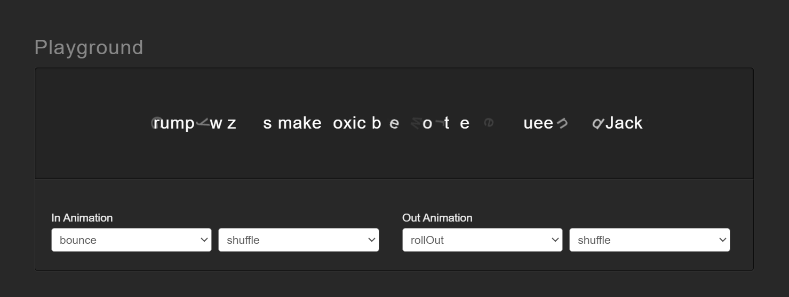

<div class="flex tlt text-8xl justify-center m-10 text-cyan-200 font-extrabold" data-in-effect="fadeIn" data-in-shuffle="true"  data-in-delay="150" data-out-effect="rotateOutDownLeft" data-out-shuffle="true">textillate.js</div>

# 尝试使用Textillate的文字动态效果
尝试如何在一篇md文章里面设置Textillate效果以及div，然后astro加载的时候可以显示。html的元素可以直接在md文件里面插入。然后我在它的模板页面中引入了必要是css和js文件。渲染之后可以在正文出现效果。之前看到一系列的blog应该也是通过同样的办法进行的。


<div id="text-element" class="tlt text-3xl" data-in-effect="fadeIn" data-out-effect="fadeOutLeft" data-out-shuffle="true">This is an example of Textillate.js in Markdown</div>

如何一切正常，上面会有动态效果的文字,成功了。试着在这里做个插件哈哈，选一个in的样式看看：（html里面的确更改了in-effect，但是重新启动的时候发现错误。再研究吧）
<div>
  <label for="effect-selector">Choose a in-effect:</label>
  <select id="effect-selector">
    <option value="fadeIn">Fade In</option>
    <option value="fadeOutLeft">fadeOutLeft</option>
    <option value="rotateOutDownLeft">rotateOutDownLeft</option>
  </select>
</div>


# Textillate 安装
[官方网站](https://textillate.js.org/)有各种样子in/out的直观体验，可以获得data-in/out-effect的名字。但是不能复制，使用时候要自己输一遍有点麻烦。大致样式如下图：


## 依赖项
该JS库有三个依赖项jQuery、lettering.js、animate.css
    <!-- <link rel="stylesheet" href="https://cdnjs.cloudflare.com/ajax/libs/animate.css/4.1.1/animate.min.css"> -->

    <link rel="stylesheet" href="https://cdnjs.cloudflare.com/ajax/libs/animate.css/3.7.0/animate.min.css" integrity="sha512-YTL2qFiv2wZNnC764l1DD5zN6lYxDzJ89Ss6zj6YoYIzr6+zwjdVKM1sUR+971X3h7qWCa9cPUBXyYqhOqWWLQ==" crossorigin="anonymous" referrerpolicy="no-referrer">
    <script src="https://code.jquery.com/jquery-3.6.0.min.js"></script>
    <script src="https://cdnjs.cloudflare.com/ajax/libs/lettering.js/0.7.0/jquery.lettering.min.js"></script>
    <script src="https://cdn.rawgit.com/jschr/textillate/master/jquery.textillate.js"></script>

开始gpt给了一个4.1.1的版本，我怎么都不能调用animate，包括去官网装了npm版本也不行。后来碰巧看了youtube视频，他装了3.7.0，然后看了Textillate的issue发现，回复说暂时没有支持4.1版本。所以换了cdn3.7.0的就马上正常了。然后不知道为什么，我现在一定要补上一个<span class="bg-red-100 w-auto inline-block border rounded-lg pl-1 pr-1">type="module"</span>，各个<span class="mdhighlight">\<script\></span>才能正确加载。小插曲，我在md文件写了这个样式，可以正常在class中使用。但是在引用的模板里面写了style却没有生效。
```astro
    <style>
        .mdhighlight{
            background-color: rgb(253 186 116);
            /* border: 2; */
            border-radius: 0.25rem;
            height: full;
            padding: 4px;
        }
    </style>
```

## Option
以下是完整的Textillate的Option：
```javascript
    $('.tlt').textillate({
        // the default selector to use when detecting multiple texts to animate
        selector: '.texts',
        // enable looping
        loop: false,
        // sets the minimum display time for each text before it is replaced
        minDisplayTime: 2000,
        // sets the initial delay before starting the animation
        // (note that depending on the in effect you may need to manually apply
        // visibility: hidden to the element before running this plugin)
        initialDelay: 0,
        // set whether or not to automatically start animating
        autoStart: true,
        // custom set of 'in' effects. This effects whether or not the
        // character is shown/hidden before or after an animation
        inEffects: [],
        // custom set of 'out' effects
        outEffects: [ 'hinge' ],
        // in animation settings
        in: {
            // set the effect name
            effect: 'fadeInLeftBig',
            // set the delay factor applied to each consecutive character
            delayScale: 1.5,
            // set the delay between each character
            delay: 50,
            // set to true to animate all the characters at the same time
            sync: false,
            // randomize the character sequence
            // (note that shuffle doesn't make sense with sync = true)
            shuffle: false,
            // reverse the character sequence
            // (note that reverse doesn't make sense with sync = true)
            reverse: false,
            // callback that executes once the animation has finished
            callback: function () {}
        },

        // out animation settings.
        out: {
            effect: 'hinge',
            delayScale: 1.5,
            delay: 50,
            sync: false,
            shuffle: false,
            reverse: false,
            callback: function () {}
        },
        // callback that executes once textillate has finished
        callback: function () {},
        // set the type of token to animate (available types: 'char' and 'word')
        type: 'char'
    });
```
## Events
Textillate触发以下事件：

- start.tlt-当textillate启动时触发
- inAnimationBegin.tlt-在动画开始时触发
- inAnimationEnd.tlt-在动画结束时触发
- outAnimationBegin.tlt-当输出动画开始时触发
- outAnimationEnd.tlt-输出动画结束时触发
- end.tlt-当textillate结束时触发

```javascript
    $('.tlt').on('inAnimationBegin.tlt', function () {
    // do something
    });
```

## Methods
- $element.textillate('start')-手动启动/重新启动textillate
- $element.textillate('stop')-手动暂停/停止textillate
- $element.textillate('in')-在动画中触发当前文本
- $element.textillate('out')-触发当前文本的输出动画


<style>
  .mdhighlight{
    background-color: rgb(253 186 116);
    /* border: 2; */
    border-radius: 0.25rem;
    height: full;
    padding: 4px;
  }
</style>