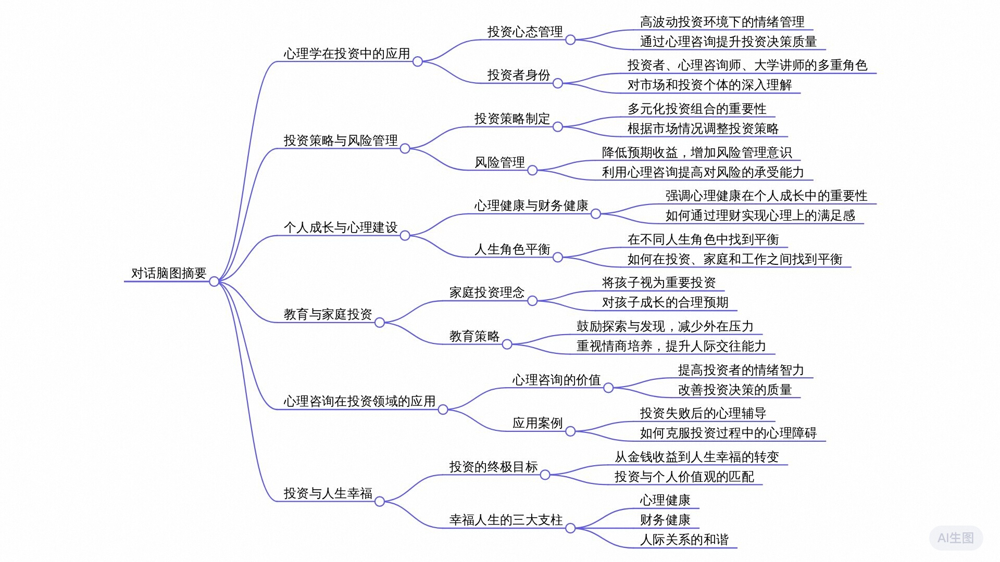

{/* 导入必要的样式和组件 */}
import '../../styles/markdown.css'
import React, { useState } from 'react';
import { Counter } from '../../components/react/Spinner';
import { Collapsible, Alert, CodeBlock, Highlight, FadeIn } from '../../components/react/Collapsible';
import { Tabs } from '../../components/react/Tabs';
import { Image } from 'astro:assets';
import ImageSwitcher from '../../components/react/ImageSwitcher';
import Video from '../../components/react/Video';
 
今天上班的路上听了此条博客，起初以为只是关于聊投资心里的，没想到访谈对象是一个多角色人物，从很多心理学、人力、投资的视角聊了人性、心里等现象，以及
如何去调整。作者和嘉宾也都提到了运动、聊天等方式对自我能量的影响。个人电量在0%-100%的一个状态表现等。秉承着分享和记录的目的，同样用通义千问的语音转文字功能，将音频转为了文字。记录一下。

【观点摘录】
1. 股票是刺激性很大的一种游戏，容易使人耐受性变高。要增加对生活中小确幸的注意和感悟，保持敏感，通过小事件提升幸福感。
2. 一定要有投资组合概念，从自己人生到具体投资。单一的股票会显得非常片面。至少扩展到etf。
3. 作者、访谈者都通过不同的角色扮演丰富自己的观察视角和思考维度。
4. 优秀的品质，谈到了修养和赌性成瘾性。
5. 面对外界压力、失败和挫折主动自我干预或者寻求外部援助。
6. 被看见的这种所以这种感觉就是对于来访来说是一个非常重要的。你能够精准的去听，同时你要精准的回应。与对话者产生一种流动。
7. 要保持一个三闲的状态去面对投资，闲钱、闲暇时间、闲的心态

# 一、播客故事
<Alert type="info" title="音频文件">
  <audio controls style="width: 100%; max-width: 500px;">
    <source src="/SeanBlog/Audios/StockMind-Audio.mp3" type="audio/mpeg" />
    您的浏览器不支持音频播放。为啥没有了
  </audio>
</Alert>

@引用自【三点下班】(投资心理学--漩涡、救赎、重建，找回财富与幸福)

## 发言总结
### 作者和嘉宾
分享了自己在投资、大学授课、心理咨询以及个人兴趣和家庭生活之间的活动和时间分配。他们特别强调了在投资领域遇到的不匹配感以及对成功的深刻理解，
认为成功不仅仅是财务上的成就，更重要的是个人成长和心理健康的维持。
在心理咨询方面，他区分了心理咨询与心理治疗，并强调了帮助他人自我探索、处理工作压力、
情绪调节和保持积极心态的重要性。他们通过实际案例分享了如何从金融投资领域的失败中恢复过来，
并指出理解情绪、在失败中寻找成长机会的必要性。此外，他还讨论了培养孩子独立性和创造力的重要性，
提倡父母应减少过高期望，倾听孩子心声，提供支持和鼓励的成长环境。
总之，他的分享强调了自我认知、情绪管理、家庭支持和个人兴趣对于个人成长和心理健康的关键作用。

# 二、全文思维导图

  {/* <image src="./20241029-StockMind/StockMind-Xmind.jpg" alt="思维导图" style="width: 100%; height: auto;" /> */}
  

# 三、全文导读
## 关键词
心理咨询师 投资 心理学 创始人 MBTI 投资经理 华师大 临床心理学 应用心理学 双重关系 创业 心理医生 危机干预 DDI 修养 赌博障碍 理性 冷漠 人品 前妻 

## 全文摘要
在这次对话中，讨论者深入探讨了股市投资、投资与心理学的交织关系、心理咨询在个人成长中的价值，以及家庭环境对孩子教育的影响。特别强调了心理健康对投资决策的深远影响，指出心理咨询能有效帮助投资者管理因市场波动引发的心理压力，从而提升投资表现。同时，强调了家庭教育的重要性，建议父母应减少对孩子不切实际的期望，多倾听和理解孩子的感受，促进其全面发展。整体而言，对话凸显了无论在投资还是日常生活中，保持心理平衡与积极心态的必要性。

## 章节速览
##### 00:00 跨界融合：投资人、心理咨询师与大学讲师的多彩生活
本期播客以分享嘉宾吕舟达的多元身份和生活平衡为主题，吕舟达在VC投资、大学授课和心理咨询领域均有涉猎，展示了其丰富多彩的职业生涯。他将时间分配在一级市场投资、大学教学及心理咨询上，展现出对知识传播和心理健康重视的态度。通过这样的分享，播客为听众呈现了不同职业路径的可能，激发对生活多样性的思考。

##### 03:01 从投资到心理咨询的转变与探索
在谈及个人职业路径时，首先提到对VC（风险投资）行业的兴趣，认为这种职业适合拥有顶尖学历背景的人士。随后，转向介绍自己在心理咨询领域的学习与实践，特别提到在华师大进行心理学的学习，同时探讨了心理学与消费行为研究的结合，特别是在艺术院校的教学经历。此外，提及了通过流行心理学MBTI研究消费偏好，显示出对跨领域研究的兴趣。

##### 05:22 投资心理学：一级市场投资与心理咨询的相辅相成
在讨论投资领域时，特别对比了一级市场投资和心理咨询的区别与联系。一级市场投资者常展现出全局思维，具有较高的视野，但可能缺乏对实际企业运营的深刻理解。而心理咨询工作则能提供更贴近真实的案例和体验。此外，还分享了投资初期的不配得感，以及通过投入投后管理来加深对企业理解的经验。

##### 08:28 投后管理与心理咨询的相似之处
在投后管理过程中，投资人与创始人或高管的交流，类似于心理咨询，旨在提供心理疏导和业务建议，帮助解决企业问题。与心理咨询相似，投资人不会给出诊断，而是提供评估和建议，帮助创始人自我成长。这种沟通对于创始人来说是一种重要的压力释放途径，因为他们可以在此过程中分享难以对其他人表达的机密和困扰。

##### 10:42 双重角色下的伦理挑战
当个人既是投资方也是心理咨询师时，面对创始人分享的个人问题，如何处理双重角色之间的伦理边界成为一大挑战。讨论中提到，这种双重关系可能引发撤资顾虑，但实际操作中，需要依据咨询伦理进行判断。当个人发现自己的双重角色可能导致冲突时，应当考虑推荐其他专业心理咨询师以维护伦理标准。此外，即便在建立双重关系的情况下，对于某些敏感信息，如危机干预需求，仍有告知的道德责任。这要求个体在实际操作中，必须对双重关系进行细致评估，确保不损害任何一方的利益和心理健康。

##### 13:00 识别有效领导特质
在进行高管招聘时，利用全面测评方法识别潜在领导者的有效特质至关重要。这种方法包括模拟办公环境下的高压面试、面对面、邮件和电话沟通测试，以评估候选人在压力和不同沟通渠道中的表现。通过这种方式，可以深入分析候选人的应变能力、问题解决技巧以及在高压情况下的行为反应，从而为最终选择提供科学依据。

##### 16:00 投资者和企业高管最看重的品质
在选择投资项目或候选人时，投资者和企业高管最看重的品质包括修养、坚韧、企图心、理性逻辑性等。其中，修养被认为是最重要的一点，它包含了理性和感性并存，以及良好的人品。在高收入或高职位的候选人中，人品和修养尤为重要。

##### 17:37 探讨个人品质对合作的影响
讨论了在评估潜在合作伙伴时，个人的修养和某些负面品质的重要性。特别提到了赌博成瘾作为可能对个人行为和决策产生负面影响的品质，同时也指出了在某些情况下，风险接受度（如'赌性坚强'）可能被看作是正面特质。强调了在评估一个人时，需要考虑多方面因素，包括其过往的行为和关系，以全面理解其性格和可能对合作的影响。

##### 19:20 股市情绪分析：踏空与被套的心态差异
在股市中，股民常遇到的心理问题包括追涨杀跌、贪婪、恐惧等。国庆假期股市暴涨，引发投资者焦虑和狂躁情绪，担心错过投资机会（踏空）比被套更让人难受。这种情绪状态在心理学上可有相似原理分析，帮助投资者理解和调整自己的心态，避免被负面情绪主导。

##### 22:15 踏空与被套的心理与经济影响
踏空和被套在经济学上分别对应机会成本和沉默成本，而从心理学角度分析，踏空可能导致严重的抑郁和自我否定，而被套虽然也有负面情绪，但因为存在侥幸心理和防御机制（否认），使得情绪影响相对较小。踏空的沉没成本无法挽回，唯一的期待可能是股价下跌，这种心理状态导致了特别的无力感和自我否定。

##### 25:23 投资失败引发的自我否定与应对策略
经历投资巨大回撤后，个人陷入自我否定循环，导致情绪低落。通过运动和心理暗示，逐渐走出困境。心理咨询强调聊家庭、成长经历、人际关系及重大事件对情绪的影响。建议听众遇到类似情况时，可尝试自我调节或寻求专业心理咨询。

##### 29:18 理解情绪管理与家庭互动的重要性
讨论了家庭成员间情绪管理的重要性，特别是当个体在面对孩子时如何有效地控制和管理自己的情绪。提到使用“悬浮注意”来观察和调整自己的情绪状态，以及意识到自己情绪电量的消耗情况，以便在情绪低落时及时抽离并休息，避免将负面情绪转移到家人身上。还强调了家庭成员之间的理想化和现实之间的差距可能导致的误解和冲突，建议在感到情绪电量低时应先进行自我抽离和充电，而不是立即对家人发泄情绪。

##### 33:33 股市投资波动与情绪管理
讨论了在股市投资中遇到的挑战，包括情绪波动、加杠杆的风险，以及如何从剧烈的市场波动中寻求平静。强调了关注自身情绪临界点的重要性，以及在极端低电量（比喻性说法）时的自我保护。同时，提到通过分散投资降低波动带来的负面影响，以及如何在经历巨大波动后，学会接受平淡和正常的生活节奏作为生活的主旋律。

##### 36:41 应对投资成功后的阶段反应与自我干预策略
在投资领域，成功投资一家公司从初期到上市能带来巨大的快感，但这种体验在投资组合中可能只占一小部分，其余的投资可能表现平平，甚至亏损，导致投资者在经历狂喜后可能感到乏味或波动感减弱。此外，还提及了赌博障碍的不同阶段和相应的应对策略，强调了在这些情况下，自我干预和主动自救的重要性。建议在遇到类似阶段反应时，通过理性的方法或步骤，如逐步减少杠杆使用，以平顺过渡到低波动期，同时强调了积极寻求专业帮助，包括心理咨询和可能的物理治疗，对于那些已经进入赌博障碍后期的个体而言是必要的。

##### 40:29 探讨成瘾行为的心理学关联与生活幸福感知
对话中讨论了成瘾行为，如赌博和过度投资，与日常生活中的幸福感知之间的关系。指出这类行为背后的强迫性思维如何导致人们寻求刺激以满足需求，有时甚至牺牲了其他形式的快乐。强调了发现和珍惜生活中小确幸的重要性，作为提升个人幸福感和避免过度依赖成瘾行为的策略。

##### 43:48 深入分析与情绪简化：投资与生活哲学
在股票投资中，感觉知识和判断之间的差距很大，导致了一些草率的决策。一个案例讨论中，某知名投资人的简单评论引发思考，强调了投资和生活中的情绪简化问题。讨论者反思自己过于自信的分析，决定通过现实生活中的细节观察，如与捏脚师傅的交流和观察行人，来提升自己的幸福感和对生活的细致感知。这反映了对深入分析价值的强调，以及在快速决策中保持冷静和理性的重要性。

##### 46:26 提升幸福感的策略
通过进行绝对正确且无挑战性的活动来提高幸福感和心理健康：这包括了日常散步、练习琴艺等轻松任务。但要警惕，过度的追求舒适可能会导致问题，如过度运动带来的伤害。此外，个人还可以通过多样化的兴趣爱好来分散注意力，从而提升整体的幸福感。具体方法包括阅读、听音乐会、观赏艺术展览或是参与相关比赛，这些都是有益于心态放松和情绪提升的活动。

##### 50:49 心理咨询案例分析：投资心理问题
讨论了心理咨询案例中，因投资导致的心理问题，包括一次投资失误寻求咨询和表现极端的案例。指出10%的个案可能需要药物治疗结合心理咨询，而另外10%的个案可能因无法控制的情绪而被建议寻求专业心理医生帮助。此外，还提及了投资行为可能引发的其他心理健康问题，如过度关注股市波动导致的情绪不稳定。

##### 55:22 股市心理咨询：面对心理战的不同应对策略
在股市投资中，人们可能遇到的情绪波动和心理挑战被比喻为与一个内在或外在的'小人'的PK。初期，简单的情绪管理或心理咨询可能足够；但当挑战升级，如遇到更大的压力或失败，需要更专业的帮助，比如心理咨询师提供的'盾牌'和'药物'，分别代表心理防御和更深度的心理干预。此外，比喻也暗示了在极端情况下，寻求外部力量或'雇佣军'的必要性。这种策略强调了在面对股市挑战时，进行心理评估和适时寻求专业帮助的重要性。

##### 57:52 心理咨询的价值：被看见的重要性
讨论强调了心理咨询中最核心的需求是被来访者感到被看见和被倾听。通过对耐心聆听和精准回应的要求，心理咨询提供了一种在长时间内专注倾听来访者，且能提供有意义反馈的体验。这种体验对于许多人来说是稀有的，因为日常生活中很难找到人能在一个小时中不被打断地听对方说话并给予回应。因此，心理咨询不仅是一个过程，更是一种提供深度理解和被听见感觉的服务。

##### 01:01:52 平衡生活与投资的心理健康与财务健康策略
随着对心理健康重要性的认识提高，讨论转向了个人如何平衡生活、投资和心理健康的策略。提及了从小城市成长的背景，说明了在早期，心理健康的需求常常被忽视，直到有了孩子后才意识到身心健康与财务健康同样重要。提出应将资金按比例分配，稳健与激进的投资策略并存，以应对不同的财务需求。同时，分享了在艺术投资和股票投资中应用类似原则的经验，强调心态、时间及资金的合理配置对于成功投资的重要性。

##### 01:06:26 家长应如何正确看待和引导孩子的成长
在关于家庭教育和孩子成长的讨论中，提出家长应调整对孩子的期望，减少高估孩子的智商，低估其情商的倾向。强调倾听孩子感受的重要性，提倡家长问孩子“你怎么看你的感受”，以便更好地理解孩子的真实想法和情绪。此外，建议家长降低对孩子成为特定成就者的期望，鼓励多看到孩子的个人特质和需要，从而促进孩子的全面发展。

##### 01:13:06 教育投资与心态管理在家庭与投资中的应用
对话中强调了教育对孩子的重要性，将其视为一种长期且重大投资，不仅包含时间的投入，也涉及到个人心态和情绪价值的投入。讨论了在育儿过程中，为孩子提供稳定基础与鼓励自由发展的重要性。此外，还触及了投资活动中常见的情绪波动问题，强调了保持理性心态对于成功投资的重要性。提到了未来可能的育儿心理学咨询节目，以及对健康心态、身体和财务状况的综合追求是幸福生活的关键。

# 四、问答回顾

作者 问：今天我们请到了哪位特殊的嘉宾？吕舟达老师的时间是如何分配的？

作者、吕舟达-嘉宾 答：我请到了吕舟达老师，他是一位多重身份的投资人、心理咨询师以及大学讲师。目前他把30%的时间放在VC投资上，30%的时间用于大学讲课，40%的时间从事心理咨询工作，剩余的10%时间用于其他事务。

作者 问：吕舟达老师如何从投资切换到心理咨询这个角色？

吕舟达-嘉宾 答：心理咨询是同步进行的，在大学期间完成了心理咨询的学习，当时在华师大学习临床心理学和应用心理学。

作者 问：在一级市场投资和心理学之间有何相辅相成之处？

作者 答：一级市场投资往往偏于抽离和全局视角，而心理咨询则涉及具体扎实的案例和真实情境，两者结合能对投资理解更深刻，帮助投资人接触企业运营的真实一面，并在投后管理中提供类似心理咨询的服务。

作者 问：作为投资人和心理咨询师，遇到创始人把所有压力都倾诉给你时，你会如何处理？

吕舟达-嘉宾 答：在投资领域中，我会在前线做好评估，并遵循咨询伦理原则。对于心理咨询层面，虽然存在双重关系的挑战，但若在能力范围内，我会尊重隐私并进行适当的心理疏导。如果涉及到危机干预情况，如轻生想法，会建议告知其家人。

作者 问：在投资过程中，有没有哪类特质会让吕舟达老师特别谨慎投资？

作者、吕舟达-嘉宾 答：在DDI工作期间，吕舟达老师作为高级测评顾问，发现一些特质会使他在投资时更为谨慎，例如那些表现出某些特定问题的创始人或团队，同时他也提到，在识别创始人特质方面有丰富的经验。

吕舟达-嘉宾 问：在面试过程中，你们采用了哪些模式来测试候选人的应对能力？

吕舟达-嘉宾 答：我们有三种模式。第一种是三天的办公室模拟环境，我会扮演甲方，对面试者进行高压提问，考验他在高压下的反应和解决问题的能力。同时，另一位同事会通过监控摄像头观察他的表现。面试题目大约有100道，场景包括办公室、面对面和电话三种方式，以测试他们在不同情境下如何应对各种问题。

作者 问：经过这样的测试，投资者或企业高管最看重候选人的哪些品质？

吕舟达-嘉宾 答：我个人最看重的是修养，特别是理性但不冷漠的修养。这种修养可以拆解为理性、感性和人品等多个方面。在高薪条件下，六边形战士般的候选人更看重的是人品和修养，因为这些品质往往无法用具体技能来衡量。

作者 问：那么，在您看来，最能扣分的品质是什么？

作者 答：从心理学角度来看，成瘾性，尤其是赌博成瘾性（赌博障碍），是一个重要的扣分品质。虽然在某些情况下，如宁德时代曾总的例子中，赌博性也被视为一种正面特质——赌性坚强。不过，这具有两面性，没有标准答案。

作者 问：在股市投资中，股民容易出现哪些心理问题？

作者、吕舟达-嘉宾 答：股民容易出现追涨杀跌、贪婪、恐惧、狂躁、焦虑、悔恨、盲目自信、炫耀、从众等各种情绪，其中特别提到了在股市上涨时急于加仓、踏空市场的焦虑感。踏空是指错过了一次上涨行情，相比被套（持有股票下跌），踏空带来的抑郁和自我否定情绪更为严重，因为它涉及到沉没成本和机会成本的心理冲突。

吕舟达-嘉宾 问：在心理咨询中，咨询师会关注哪些维度来了解来访者的情况？

吕舟达-嘉宾 答：心理咨询师在与来访者交谈时，会关注四个主要维度：原生家庭、成长经历、人际关系以及近五年的重大事件。这些因素都可能对来访者当前的情绪状态产生影响。

作者 问：如果听众面临类似负面情绪困扰的情况，在尚未寻求专业帮助时，有什么具体的建议可以尝试吗？

吕舟达-嘉宾 答：运动是一个非常重要的应对方式。建议像监测手机电量那样关注自己的情绪状态，当感觉“电量”（即精力和情绪承受力）低于25%时，可以通过提升自我觉察，比如采用“悬浮注意”的方法，即以一个旁观者的视角看待自己面对问题时的状态变化，并尝试把情绪调整回安全水平。

作者 问：当个体电量极低（例如5%）时，应该如何处理情绪以避免对家人或孩子发脾气？

作者 答：在电量极低的情况下，应首先让自己休息，远离消耗能量的事情，至少让电量恢复到20%以上。如果电量非常低，可能需要通过转移注意力或短暂离开现场来避免情绪失控，将负面情绪置换到自身。

作者 问：针对职场人士下班后对家人发脾气的现象，心理咨询师有什么建议？

作者 答：这种情况多源于职场压力导致的一天中意志力和能量耗竭后，回家面对家人时无法控制情绪。建议关注自身情绪状态，提前预警并采取措施远离人群，避免情绪进一步恶化。

作者 问：为什么会出现“最爱的人伤我最深”这种情况？

作者 答：这是因为我们在对家人的情感投入上往往更高，当期待与现实不符时，更容易受到伤害。同时，家庭环境带来的安全感也可能让我们更直接地表达情绪，甚至说出伤人的话。

作者 问：在投资领域中，如何处理投资成功后狂喜情绪与平淡生活的切换？

吕舟达-嘉宾 答：投资成功后经历的狂喜和从高峰回归平淡的过程是一种阶段反应。尽管自我干预难以避免，但可以通过主动调整，如调整杠杆、分散投资等方式，逐渐适应较小波动的生活状态。若已进入赌博障碍的第三阶段，仅靠技术手段或他助难以完全摆脱，需要个体主动寻求改变和自救。

作者 问：在二级市场中，游资的投资风格有何特点，以及这种投资风格与赌博成瘾性有何联系？

作者 答：游资在股票市场中通常采取大开大合的风格，他们会根据热点快速重仓进入。据说游资群体中存在一种心理现象，即当他们在股票或赌博中获得极高刺激和快感（如赌博可能带来100分快乐）后，很难从日常生活中的其他活动如性生活中找到同等程度的快乐，这与赌博成瘾的心理学特征存在必然联系。

吕舟达-嘉宾 问：如何训练自己感知幸福的能力？

吕舟达-嘉宾 答：可以通过记录日常生活中小事带来的快乐，例如在乘坐地铁时的巧合、开车遇到畅通的道路和好天气等小确幸，并尝试训练自己去发现并记录这些生活中的细微幸福。

作者 问：对于投资者过于简化复杂问题的现象，您怎么看？

作者 答：投资者在面对复杂问题时，有时会过于简化并情绪化地用几个词概括整个事件，这种行为可能源于焦虑或疲劳。我们应该鼓励他们深入理解问题，多关注细枝末节，提升感知幸福的能力。

作者 问：在心理咨询案例中，有没有因投资导致心理问题的典型个案？

作者、吕舟达-嘉宾 答：在心理咨询案例中，大约10%的个案是因为投资失误寻求心理支持；另外10%是投资者试图通过心理咨询来寻求市场投资建议。对于这类情况，我们会进行短时间沟通，满足其被倾听和看见的需求。而对于极少数表现出强烈投资倾向和精神状态异常的个案，会建议他们转诊给心理医生，可能需要药物治疗结合心理咨询。

作者 问：如果看到身边有人在股市中出现疯狂推票、情绪极度波动的行为，应该怎么做？

吕舟达-嘉宾 答：这种情况可能是由于长时间的压抑导致神经递质紊乱和神经元受损，建议去看心理医生。

作者 问：A股股民中是否存在普遍的心理症状？

作者 答：是的，很多A股股民存在长时间压抑的问题，这在十一假期前后的市场大涨中尤为明显。

吕舟达-嘉宾 问：心理咨询在帮助股民方面的作用是什么？

吕舟达-嘉宾 答：心理咨询师能够提供一个评估环境，帮助投资者理解和应对投资过程中的心理压力，并在必要时给出药物治疗建议，以缓解极端的情绪波动。

作者 问：心理咨询师对于来访者最重要的需求是什么？

作者、吕舟达-嘉宾 答：被看见是来访者，甚至是更广泛人群的重要需求，即有人能够耐心、专注地倾听并给出精准回应。

吕舟达-嘉宾 问：心理咨询师的工作能力要求是什么？

吕舟达-嘉宾 答：要求心理咨询师能够持续1小时不间断、精准地聆听和回应来访者，帮助他们整理思绪，产生流动感。

作者 问：在财务健康方面，有没有针对投资者的财务配置建议？

吕舟达-嘉宾 答：建议投资者采用类似三七原则进行资产配置，例如70%投入头部稳健项目，30%投入激进型项目。

作者 问：对于以投资为职业的人来说，如何运用“三闲”投资法？

作者 答：“三闲”投资法强调使用闲钱、有闲暇时间以及保持平闲心态进行投资，但这主要针对非全职投资者或不具备全身心投入条件的职业投资者。

作者 问：从心理咨询的角度，如何帮助家长更好地理解和引导孩子？

吕舟达-嘉宾 答：建议家长降低对孩子成就的过高预期，多关注和看见孩子的真实感受，尤其在情商层面要高估孩子的能力，多问孩子感受，避免自动化反应，从而更好地理解和引导孩子。

# 五、录音全文
lo6z_r2uCRGbyQfg2IpjLcxowPTn_原文
2024年10月29日 09:04
作者   00:30
嗨大家好，欢迎收听三点下班。这是一档有趣又有料的投资陪伴型播客，每期围绕着股市和股民生活随便聊聊。我是李永浩。本期我们请到了一位不同以往的嘉宾。因为熟悉我们节目都知道，以往都是要么是私募基金经理，要么是公募的。这些朋友们，行业内内的朋友来跟我们聊一聊大势，或者说板块行业。

作者   00:52
但今天不一样，今天我请到了一位，我先卖个关子，我先说跟这位嘉宾是怎么结缘的，就起源于我听杨天南老师他听懂掌声这期节目其中有一期叫我们都有病，这个时代我们都有病，就差不多这个标题，到时候我会把这一期的链接放在我们note里面。当时我正在新西兰，我在逛超市，因为这一期实在是引起我太多的共鸣了，所以我当时就愣是把这一期一个多小时全部听完了。直到我老婆给我打电话催我回去，我才想起来，原来已经时间过去那么快。所以今天我们请到的这位嘉宾是吕舟达老师。周达老师我简单介绍一下他的多重身份，就是等会朱达老师可以再仔细的展开一下。首先他是一个投资人，他其次还是一个心理咨询师，同时他还在大学担任一些讲师的角色，当然还有其他的一些角色，我们可以请朱导老师简单讲一下。

吕舟达-嘉宾   01:48
大致的话就是从时间分配。现阶段的话百分之把这个30的时间放在VC上，投资上，一级市场，30%的时间放在大学讲课上。我大概是四所大学的课外导师，然后还是中国美院的课桌教授，以及研究生的校外导师。对，就很喜欢做在高校，在高校能让我平静。对，然后40%。

吕舟达-嘉宾   02:19
因为现在行情的关系，我相信一级市场二级市场朋友都知道。所以我差不多有40%的时间放在心理咨询上，大概是这样的一个分配。是朱丹老师。

作者   02:30
这个经历，其实我当时在听的时候就有一个有一个很鲜明的对比。因为我自己是一个全职的股民，然后幸运的是我时间就比较自由，所以我可以带着家人或者我自己闲暇的时候就多去世界各个地方去去生活。所以我的这个状态就是我的这个生活版本，算是很多人羡慕的。但是在我的生活的眼光里，其实你这个版本是我期盼中的一种生活。

吕舟达-嘉宾   02:58
我们是彼此羡慕的，特别羡慕您的生活状态。

作者   03:01
对，就是那种首先投资人这个是就是我以前想要去做的就是VC这一块。因为在我读书那个时候，等会我在这在这里可以补充一下朱丹老师的学历背景。他是上海交大的本科加伯克利的硕士。所以这种学历背景去做一级市场投资，我觉得是顺理成章的。因为在尤其在我们早些年那投资，尤其一级市场投资是一个典型的精英行业。所谓的清北复交再加上美国留学的背景，去做投资我是一点都不吃惊的。所以这个经历，这个履历，我是觉得一个典型的精英路径。

作者   03:36
但是第二点，然后你去做了心理咨询，我当时就觉得很有意思了。后来又听听你那期节目，又说你还做了那个客座教授，就是讲师。但我不知道这个头衔是怎样，反正就是在高校里授课。对，然后还有打叠，对这种多重角色的反差感，就让我想起了什么摩根大通的那个CEO。然后他说白天在投资银行里工作，然后晚上去打的。

吕舟达-嘉宾   04:02
这种他都快成为百大DJ了。

作者   04:04
那是非常厉害的。对，就这种反差感以及这种多重角色给自己生活带来的丰富度和冲击，是我特别向往的。所以其实在这里我是很想知道你是当时是怎么从投资切换出这样不同的角色。比如说心理咨询，你是从什么时候开始做这一块？

吕舟达-嘉宾   04:24
心理咨询是基本是同步的，是间都是在大学的时候完成这个心理咨询的学习。当时交大对面是华师大，然后我是在华师大学习的临床心理学和应用心理学。

作者   04:40
又怎么去跟艺术院校，还有其他的高校，就是产主要授课的内容也是关于心理学的一些东西。

吕舟达-嘉宾   04:47
关于和投资相关的。现阶段我最近在中国美院开始有几门MBTI的这个课程哦啊偏向于流行心理学，以及因为我那个课程的研究的方向是用流行心理学MBTI。然后去看看当中是否有一些规律，到底是啊什么样的人群，爱人他更加喜欢去线上购物还是线下购物，或者爱人他更加偏好于是否喜欢和营业员的互动，还是他不想和营业员互动。做了这样的一些和消费相关的研究。

作者   05:23
所以这时候我们把这个话题切回到我们这期播客的主题。其实我们是聊股市和股民生活，但其实是一个泛投资的。像你在一级市场，你做你的投资工作的时候，那跟你的心理学这中间会有什么相辅相成或者相帮助的东西吗？因为我自己觉得就是像我做股票，还有我身边也接触到一些一级市场的朋友，他们很容易有一个典型的特征，就是特别的开天眼，特别的站在所谓的上帝视角，然后干什么事情都给你总结出一套商业模式。就说的难听点，说的好好听点叫全局思维，然后视视野特别视视角特别高。但是说的难听一点就是不接地气，就很难接触到真实的这个企业运营中的脏活累活，或者说他很难有更深刻的体感。

作者   06:12
你做一级投资，那其实是偏前面一种。但是如果你做心理咨询，那其实面对的就是一个又一个的扎实的案例，一个真实的人，一件一件真实的事情。所以我觉得这两个，一个是往往往上面去抽离，一个是直接脚就是把手弄脏，或者说直接脚挨着紧紧挨着土地的那种感觉。应该会对你的投资会有一些更深刻的理解或者帮助。

吕舟达-嘉宾   06:39
会的，因为我本身在刚入行做投资的时候，我会有一种很强烈的不配得感，这种不配得感是来自于我当时20岁出头。然后你会这个时候你会去一些企业去走访，去考虑是否去投资它的时候，你会发现对方都是非常资深的创始人，他的年龄有可能都是四五十岁了。对，而且他对于行业非常扎实，学历背景都是一流的。你在和他沟通的时候，其实他会对你非常尊重，吕总或者是吕老师。因为投资VC这个圈子是你刚入职就是投资经理。如果说你能够投一个比较好的项目，或者说你能够发展比较快，你就顺间有可能会变成VP或者说是更高的这个职位。因为他本身人就少。

吕舟达-嘉宾   07:26
对，然后这个时候当对方说吕总跟你讲一些问题的时候，我是会有一些不配的感觉。因为我对于商业的本质，我个人觉得还是偏向于浮于表面。虽然在大学期间，大学四年都是在创业，但依旧还是让我更加的敬畏他们。所以在前期的时候确实会有这样的不配得擀，所以我后期我就会把我的工作放在一部分在投后上了投后，对，因为VC它是四个工作，募投管退。对，穆穆穆兹就是去搞钱，投资就是到处去看项目，然后给他进行这个相当于把钱打给他。

吕舟达-嘉宾   08:02
然后这个投后，就相当于对这个企业，相当于你们已经是，一家人了，你帮这个企业做一些无论是流程优化，或者做一些战略咨询，或者做一些招人，或者帮他进入下一轮的融资，FV，这些其实都是在投后的范围。所以我在这个投资的这个VC的背景当中，我大概概有50%的时间是在做投后。因为我也比较喜欢做投后。

作者   08:28
所以在投后的过程中，你跟这些创始人或者说跟他们的高管，跟他们公司聊这些业务的时候，其实就有一点类似于你做心理咨询当中。没错，一点一点把这个其中的事情给它拆开，给出你的建议。

吕舟达-嘉宾   08:40
这里面有有一些点，会有一些小小的不一样。心理咨询的话，我们是助人之主，是帮助别人，让他去帮助自己哦啊心里不会给建议，对，心里不会给建议。包括我们和心理咨询师和心理医生的区别，就是心理咨询师会给到一个评估，但是他不会给诊断，但心理医生会给诊断，就相当于是你现在判断出来。比如说判断出来是双向情感障碍，然后你需要用药以及结合心理咨询，这是心理医生给出的诊断。那我们心理咨询的话是不会给出这样的诊断，以及大多数的时候不会给相应的一些建议。

作者   09:23
那你能不能举一两个例子，比如说你在投后的过程中，就是那种咨询工作或者说投部管理工作跟心理咨询当中有一些类似的这种案例。咱们可以不用说名字，或者说如果方便的话。

吕舟达-嘉宾   09:37
对，因为我我们习惯习惯性的话会脱敏，大体上是一样的。其实这些创始人我们我们可以设想一下，我相信我们的听众朋友很多也是创始人。你会发现当你在企业上遇到一些问题的时候，你没有办法和你的朋友去说，你说了他也听不懂。你没有办法和你的合作伙伴说，因为你说了之后，这里面会有一些机密的问题，你也没有办法会和同行说，然后夫妻更不能说。而这个时候你最容易去说的一个人其实是两个人，一个是心理咨询师。对，是你可以把你的压力，把你的抑郁跟他说的。还有一个就是你的投资人，我不小心就是兼顾这两者。所以我的这些投资的这些项目方的创始人经常会和我聊天。虽说我们在聊天看似是在聊工作，其实更多的是一种心理的疏导，或者说是已经进入到一些疗愈。在过程当中有可能会出现运用到一些技术。

作者   10:43
这里我有问题了，因为你是一个很特殊的角色，你既是投资方又是心理咨询师。但是如果你仅仅有投资方向一个角色，那假设我是一个创始人，我把我的压力大的困难痛苦全部告诉你那你会不会撤资？

吕舟达-嘉宾   10:57
这个是我们在前线就会评估好的。而对像您刚刚说的这种压力一些这样的各种各样的问题，其实每一个创始人都会有。这是一个共性是共性的问题。当然了，这里面又涉及到另外一个比较边界性的问题，就叫咨询伦理。理论上说我和他已经进入到双重关系了。如果从我们的这个机器理论上极其严格的角度来说，是只能做二选一。要不然我就是他的投资方，我的相当于是我是他的合作伙伴，要不然我就是他的心理咨询师。这二者的关系，这个伦理的把握这个度是很有挑战性的。

作者   11:39
你说这个双重关系让我想起来前两天我们在吃饭的时候在聊，如果你的朋友把他的孩子扔给你做心理咨询，那这个时候你怎么来处理你跟这个咨询对象和你的朋友之间的关系，就是你要不要把他孩子的一些事情告诉他。

吕舟达-嘉宾   11:58
这是一个非常挑战性的问题。但是我觉得人还是有人之常情在的。比如说我可以去按照我们所学的咨询伦理，就是说让我们已经有双重关系了。我会让我的朋友去找其他的心理咨询师，我也可以推荐。但是朋友的角度来说，此刻这件事情对他来说已经很严肃了。然后他也不太去容易信任到别人，那我一般会对他进行一个评估。如果这个评估范围内，我觉得在我的能力范围内在我的边界之内的我是可以做咨询的，在我的边界之外的我就不能了。

吕舟达-嘉宾   12:32
比如说像您刚刚提到的哪些可以跟我的朋友说，就关于他孩子的问题，那么我肯定是尊重他的孩子我会问我们今天聊的大概四块内容，有哪些可以跟你妈妈说，哪些不可以跟你妈妈说的？除非涉及到需要危机干预的，比如说他有轻生的想法，以及已经有一些计划了。那这个从国内的咨询伦理道德来说，是需要告诉他的妈妈的，就不管他是否同意。

作者   13:01
我之后脑子里又衍生出另外一个问题，我不知道你有没有总结过，就是在你做了那么多心理咨询和投了这么多案例之后，有没有哪一类人就哪一类创始人或者哪一类团队，他如果有某一个品质或者某一类特质，你就特别的谨慎的去投资它。或者说然后反过来另一面就是有没有哪一类品质是你发现这个人有这种品质之后，你就会更倾向于投资他。有没有这些关键词可以让我们来学习一下。

吕舟达-嘉宾   13:30
这个问题我觉得从某些角度来说是问问对人了。因为我的经历当中有一个经历是在全球最顶级的人力测评公司叫DDI，在这家公司里面我是顾问，是高级测评顾问。我的工作就是去识别创始人。比如说很巧，今天我们这栋建筑是啊罗康瑞的这个瑞安，罗康瑞的建筑。对，没错。因为当时的话有一个场景是罗总他当时有两个有有一有一个职位，然后需要给到两个高管，猎头已经帮他找了两个高管，但他最后二要二选一。我们的工作就是通过各种的立体性的测评方式。因为这家公司全球这家应该说最顶级的人力测评公司之一。

吕舟达-嘉宾   14:16
前期是美国的一个训练间谍的一家机构。二战的时候，二战之后，这家公司开始进入到军民一体化，就开始做咨询，这也非常贴切。我们当时的做法就是有三种模式。第一种模式一共是三天时间，第一天时间就是让这个面试者进入到一个办公室模拟的一个办公室的一个环境，那么我此刻我相当于是他的一个雇主，我相当于是他的一个甲方。对，比如说我们先给他一个场，有点像现在玩在玩剧本杀一样的。然后这个面试的人，他此刻就相当于告诉他，你现在是一个机器人公司的一个卖机器人公司的一个高管。但是你的机器人出了各种各样的问题，那么我相当于就是这个出问题的方甲他的甲方然后来质问他。

吕舟达-嘉宾   15:11
我在质问他的过程当中，我会不断挑战他的极限。然后同时我的另外一位同事就会在其实这个办公室里面会有很多摄像头，我的另外一个同事会在另外一个房间在监测我在对他做出这种高压提问的时候他的一些反应。踩点答分我们大概有100道题。哇塞在一天里面时间我们会不断的测试它，场景分为三种，第一种就是在办公室里面，第二就是面对面的方式，第二种是通过邮件的方式，第三种是通过电话的方式。反复的测试他在面临各种各样的问题的时候，有什么样的一个应对方案。最后是这两个候选人，我们会有两份很详细的报告给到罗总看，罗总来判断到底选谁。

作者   16:00
所以最后总结出来那些品质，你觉得哪些点或者说哪一两个点是最最被投资者或投资人，或者说最被企业高管所看重的？

吕舟达-嘉宾   16:10
因为我说一下我个人个人最看重的一个点就是修养。修养对我个人最看重的修养。

作者   16:17
我这个词很泛化很古老。对，因为你怎么去定义修养呢？因为我我在我在你获得这个答案之前，我可能脑子里想的是比如说像坚韧。

吕舟达-嘉宾   16:28
企图心这类。

作者   16:29
的野心。

吕舟达-嘉宾   16:30
或者说这理性逻辑性。没错，这些都。

作者   16:34
会有修养是怎么给它拆解出来的。

吕舟达-嘉宾   16:39
修养的话可以看我觉得用一句话来概括，就是说他可以理性但不能冷漠。

作者   16:47
他可以理性，对，但不能冷漠。对，这个就是我理我我进一层理解，就是他理性和感性都要有。对。

吕舟达-嘉宾   16:57
而且他的我们其实更再把它剖析开的话。

作者   17:01
更多的是一些。

吕舟达-嘉宾   17:03
人品OK。因为到了这个阶段，当时的大概是500万年薪的这样的一个收入的话，那这样的一个候选人给到他的这样一个收入。这类的人基本上都已经是六边形战士了。对对对，我们前面说的那些都有了。是是是，所以到最后更多的是看他的一些人品，或者说看他的一个修养。所以有的时候我们在跳脱出在VC我们在投一个项目的时候，在投决会之前，有可能我会和这个创始人的。

作者   17:37
前妻。

吕舟达-嘉宾   17:38
对，我会和他的前妻聊一聊。因为如果说我们把刚刚说的这个修养，我们作为一个概括化的话或者具象化的话，那非常简单，就是和他的前妻聊一聊，修养就出来了。

作者   17:52
那那你这个案例还比较独特，必须有前妻才行。

吕舟达-嘉宾   17:56
不是前妻。或者说他的曾经的一些朋友有一些朋友有或者说他的之前的一些下属，或者说之前的一些员工，离职的一些员工是这个时候我们都会去聊一聊，我会非常立体型的聊。

作者   18:11
修养算是最最看重最能加分的那如果说最能扣分的品质，你觉得是哪一两个关键词？

吕舟达-嘉宾   18:19
如果从我心理学的角度来说，我会把这个成瘾性放进去，就是赌博。哇哦我会把赌博的成瘾性放进去，就是赌博博障碍。

作者   18:28
赌博障碍这个东西正好就引到我们，等会要重要的我们股民的这个心态。赌博障碍这个词或者说成瘾性可能在某些投资人去评判创业者的时候，他甚至是一个正面的。比如说我记得宁德时代的对那个曾总曾就是曾老板，他的办公室就挂着一个叫赌性坚强。

吕舟达-嘉宾   18:52
没错，所以我刚刚在您在问我这个问题的时候，我是说从我的这个角度自己的对，确实是我虽然是学经济学这个宏观经济，我更多的还是看重这个风险厌恶型风险厌恶我还是比较偏向于这样的确。

作者   19:09
确实赌性或者说成瘾性的这个是不是持续的全部压上去下重注，这是一个非常两面化的问题。没错，没有标准答案。

吕舟达-嘉宾   19:19
没错。

作者   19:20
这个也是我们在股市，就是股民我们这个群体当中很容易出现的一种心态。就是经常我们有个表情包就是满仓干，不要怂。对什么赢了会所嫩模，输了下海干活，是这个就深刻的很生动的表达了我们某些股民的一些心态。其实我我在我们录这期之前，我是想了很多我们股民容易遇到一些心理问题。我还专门查了集体就是基PT，就是官方的或者机器人告诉我答案。我就问股民有什么典型的情绪？那当然就列了很多了，比如说追涨杀跌、贪婪、恐惧还有什么？我还我还记录了一下狂躁、焦虑、悔恨、盲目自信、炫耀、从众，反正就是我觉得是人性的，各种情绪都有，股市或者说其他的资本市场它会把它放的更大我觉得我们很难就每一个情绪来展开，但我想了几种情绪是我我自己近期深刻体会到的。

作者   20:19
比如你看我们今天录制的时间是10月20号，在我们这个国庆节。假期的那几天我们的A股是暴涨的，那个不叫大涨，是叫暴涨，直线拉升。是所以叠加当时这个上涨的这种情况，和当时一些自媒体推波助澜。所以在我的观察中，整个国庆假期只要是你炒股的或者接触到这些信息的人，可能他们都很焦虑的在想办法去筹钱。没错，甚至还有说排队开户。然后那些券商还都说有些孩子国庆假期不休息。对，加班加点开户。

作者   20:56
那种时候我就感觉自己和身边人沉浸在一种焦虑，一种狂躁的状态。我们怕什么呢？我们怕赶不上这趟了。

作者   21:08
对应到我们股市中一个专有名词叫踏空。没错，踏空的反义词叫被套，这不叫反义词义词就反面的情况，我给大家稍微解释一下，这个相信我们的听众应该都知道。被套就是你买了之后，比如说十块钱买一个股票，然后来跌了，跌到九块钱、八块钱你都不舍得卖，你就想等他有一天回来就要被套。那踏空是什么意思呢？就是我有两个股票可以选，比如说A和B那我买了B没买A结果B就结果结果没买的那个A股票就暴涨，那B没有涨，这是一种踏空形式。还有一种就是我在大涨之前卖了它，也就是就踏空暴涨那也是踏空。还有另外一种是可能是我觉得这个是个机会，但是犹豫了一下没买，心态上也觉得自己是踏空了。是的，我自己的感受以及我身边的感受是踏空其实比被套要难受很多很多。

吕舟达-嘉宾   21:59
没错。

作者   22:00
这个东西在心理学当中有没有什么类似的原理或者解释，能够让我们就每一次在面对踏空的时候，能能有一个武器来给自己这种情绪合理化，或者说帮助自己跳跳脱出这种负面情绪当中。

吕舟达-嘉宾   22:15
在我之前看的一些文章，它会比较夸张的说，这个踏空比被套痛苦100倍。当然这个是有些夸张的，但是如果我们我们再量化一下，从经济学来说，这个问题就是一个是机会成本，一个是沉默成本。对，因为这个踏空它其实已经是一个沉没成本了。对，是对。那如果从心理学上来说的话，其实踏空会让我们产生一种比较严重的抑郁以及自我否定。

作者   22:52
那为什么被套？它产生我觉得被套应该也能产生这样的情绪，但是也会比就差很多。

吕舟达-嘉宾   22:58
对，就是两权相害去接亲。因为被套厢来说他有一些侥幸，有一些机会点。他觉得未来我还是可以再等一等的，再等一等再等一等的。而且这里面被套的话，从心理学来说，我觉得它进入到我们的一个叫防御机制当中的否认。

作者   23:20
因为防御机制当中的否认。

吕舟达-嘉宾   23:22
对这种否认我们有，我推也推荐我们的听众朋友们看一本书叫为什么我们总在防御，我一直在推荐这本书，它里面就强调为什么我们去否认呢？因为是我们内心，我们大脑的一个保护机制，我们为了逃避痛苦而和自己说的一个谎，而这个谎就是否认我们会觉得过两天就好了，或者说再过一段时间我们和时间做做朋友。踏空的话就是进入到。因为对于踏空来说，它的那个成本完全是沉没成本了，和你已经没有任好关系了。你现在唯一期待的就是它跌，对吗？唯一期待是跌，所以这里面你的心态会形成三种状态。你会对于昨天的这个错误的行为，会觉得自己特别无用，会觉得今天你面对的这个你踏空了，然后不断在涨，你会觉得特别的无力感，你会觉得明天我特别无望，因为你不断看到他涨了那么多，你会觉得那钱应该都是我的。对对对，然后往陷入到一个自我否定，极其的自我否定的一个状态。

作者   24:35
对，就是你刚才说那一点，特别特我特别有感触，我感觉这个钱本来是应该我的，没错，那最痛苦的就是我本来应该得到，或者我本来可以得到结果却没有。

吕舟达-嘉宾   24:44
对，这个就相当于再回归到，因为我们会有一些横跳，我们再跳到经济学来说的话，这就相当于沉没成本。那很容易理解，就是我们丢掉一块钱，需要赚几块钱，能够让我们太平和通过心理的或者通过经济学的测试会发现是三块钱。所以我们在聚焦刚刚说的那个点，其实有可能没有100倍那么多，踏空和被套大概没有100倍。但是我们如果量化的话，你踏空这一次，你比如说损失了100万，那有可能你需要300万才会让你的心态能够平和。

作者   25:23
至少要300万哇哇这个确实，所以就解释了踏空比被套难受那么多。对，然后你刚才一开始说踏空会带来我们严重的自我否定。这个东西就让我想起了我自己的一个案例，正好心理咨询师在线问诊。但是我我其实可能我们老听友都知道我们这档播客是就是我在2022年我跟我的搭档我们一起做开始做的那其实起因就是因为我在家，当时我在家全职炒股已经快两年了。

作者   25:55
我自己陷入到我理解成是一个轻度抑郁当中，表现之一就是不停的自我否定。我在前面十几年的投资生涯都比较顺，然后那一年我是遭遇了最大的回撤。然后那一次回撤之后，而且就是我无论怎么调整策略，或者说调整我的方向，就总是亏。然后那个就被打击了之后，可能是因为太顺了。然后那一次打击之后就让我不停的陷入自我否定的循环。然后我会脑子里就像跳出一个小人在指着我不停在骂一样。就说你只是运气好，你以前能够取得一个好的收益倍数只是运气好，那你现在没有运气了，你你你就是个垃圾，就不停的会有这种声音跳出来。是的，我当时一个表现就是因为我有孩子，我在带完孩子之后，面对孩子肯定是笑的。然后当孩子比如说被我老婆接过去，或者他去干其他事情了，我一转一转脸，马上这个脸的笑容就消失了。

吕舟达-嘉宾   26:52
对，您在压抑。

作者   26:53
对，就耷拉下来了。然后就在那样子一个负向循环当中，我就觉得不太对我觉得不太对我觉得我虽然没有到求医问药那个时候，但已经感觉这个状态不对了。所以我当时就自己去看了很多心理学方面的书籍，我就想自我来调节一下。所以当时我的一个办法就是强迫自己去运动，去基本上每天都除了健身房还有super monkey这些就一直运动。然后运动之后确实对于我的这个情绪有了一个就像我本来是在一个不断往下的漩涡里，但是运动分泌的这个多巴胺和内啡内啡肽就暂时的把我悬浮在一个地方。是然后这个时候再用自己的一些心理的积极暗示，然后自己才把那个走出来。后来我也就想我不能再这样下去了，我要我要不停的去疏导或者说找人聊天，然后就有了这档节目。但我就不知道我这种案例就是因为投资不顺，或者说因为其实放宽饭来，比如说工作不顺，或者说情感不顺，他都会对自己的这个本来他可能是一个事件，但是这个事件对你的他的打击就可能让你陷入一个不断的负向循环当中。是不是在你们心理咨询当中，他们很多重度的或者中度的，可能也是由这些一两个小的事件不停的累积，或者说你没有及时的制止这个负向的趋势，然后逐渐演变的越来越恶化了。

吕舟达-嘉宾   28:15
这里面就是会考会强调一个心理咨询他到底在做些什么，一般的话我们看似我们看到电视里面都是会觉得心理咨询师在和来访不断聊天。但其实在聊天过程当中，它是有很强烈的目的性的。基本是四个维度。第一个维度就是要聊来访的原生家庭。第二个维度就是要聊到来访的成长经历。第三个是人际关系，第四个是非常重要的，是近五年发生的重大事件。所以像您刚刚说的那个，就是处于一个近五年发生的一些重大事件，这些诱因都会影响到来访的心情的一个状态，它有可能会形成一个重叠。

作者   29:01
那如果面对假如说我们听众当中也有类似这样的情况。他现在也没有到求医问药或者说去去找心理咨询师的时候，他也想摆脱可能负面情绪对自己带来的长期影响。你有没有什么具体的建议？运动肯定是一个很。

吕舟达-嘉宾   29:18
重要的对方式，运动是最好的。其实您刚刚说的那套方式应对的方式，我可以看作是一个教科书式的。真的吗？

吕舟达-嘉宾   29:27
您的应对方式，比如说你感受到和孩子在一起的时候的状态，然后瞬间把头转过去之后，你的一个情绪的变化，这个是你已经觉察到自己了。这个能力是非常重要的哦啊如果说我们在量化的话，我平时会经常和我的来访说，我们每天要像看手机一样，知道我们此刻的电量。80的时候我们可以做很多事情。如果到20到了19，我们的电量已经开始变。19%的电量已经变红的时候，我们就有很多事情不能做了。比如说像您在那个时刻，你可以把你的我们心理学所谓的叫悬浮注意拉起来。就是你可以在一个第四，在一个上帝视角看自己在面对孩子的时候的状态的自己，以及在转过身去一个人独处时候的状态。这个时候就证明你的电量其实还是够的，至少应该在25或者更高一些哦啊如果说你的电量假设是在5%的话，那有可能我把这个问题问问您的话，你觉得你在那一刻你会怎么做？

作者   30:26
我应该让自己休息，就是远离所有需要消耗我能量的事情。然后让自己至少把5%的电量回到20%。

吕舟达-嘉宾   30:35
那这个时候其实还是在20%电量。那我直接讲，如果是5%的电量的时候，你会直接把你的压抑的情绪发泄到孩子的身上，用一种置换的方式。

作者   30:46
对。

吕舟达-嘉宾   30:47
真的是对，那是5%，因为你已经没空考虑那些了，你的悬浮注意你的上帝视角已经回归到你的眼前了。

作者   30:54
对，这个就是我我我后来因为我也看很多育儿书籍以及这些案例，就经经常会有一个在职场人身上发生的情况。就是当你上了一天班之后，对很容易回家就对孩子发脾气。你的意志力一天的意志力和能量是有限的。然后被耗光之后，当孩子有做了一两点让你不高兴的时候，你当已经没有办法再用新的心力去掩饰你的情绪了，可能就直接就爆发出来。

吕舟达-嘉宾   31:19
而且在此刻你的潜意识当中，孩子是安全的，就是在在这个环境下是让你觉得安全有安全感的环境。比如说同样的孩子，你如果假设他说我对我的孩子有可能很凶，我同样的下了班一天很累，我到我同事家的孩子他依旧很吵，但我不会对那个孩子发任何脾气。但回到自己家。

作者   31:40
有可能会对经常有句话说这个最爱我的，我最爱的人伤我最深。不对。

吕舟达-嘉宾   31:46
就是我们差不多张雨生。

作者   31:47
的歌是那那是那是被动，就是最爱我最爱的人伤我最深。就可能是你你对他付出的高的情感和最大的期望，结果你没有达到预期，或者他伤害你，这很深。

吕舟达-嘉宾   31:57
但另外一个角度。

作者   31:58
最爱我的人我伤他最对对我们可能对我们同事或者说陌生人说话都客客气气的。但对于家人，不管是丈夫、太太，然后孩子，可能都会暴露出你更直接的一面。其实有些话是伤人的，无论是我自己，我后来想自己对孩子以及我小时候我的父母有些话对我，可能他们会觉得自己家人就更直白，其实那那是蛮蛮伤人的对。

吕舟达-嘉宾   32:26
其实这样是不对的，而且即使瞬间去改变是不现实的，但前提你是要知道为什么你回到家里会有这样的情绪。其中有三点，第一点是家庭是让你觉得舒服的安全的，安全是第一位。第二位的话是啊此刻你会对家人进行一个理想化，就是你的理想。比如说我的孩子满分100分的试卷，每次都做20分，那我我我会我会很生气，我对他的理想化，这也是一种我会觉得他就应该是100分的。

吕舟达-嘉宾   33:02
同理也可以理解为一些情侣，为什么这些情侣在交往一段时间之后会出现很多问题，会觉得你为什么牙膏要从下往上挤？对，为什么快递在旁边你都不去拆？因为此刻你对他已经有了这种理想化的防御。你觉得他应该是把快递拆的，他应该牙牙挤牙膏的方式，按照你喜欢的方式去挤。这两种是比较代表性的。

作者   33:26
面对这样的情况，如果真的只有5%的电量，那你给我们最好的建议是先怎样先抽离出来，还是对。

吕舟达-嘉宾   33:33
5%。如果真的是进入到5%的电量，那此刻就随随自己去吧。因为到了5%的电量的时候，你已经没法控制自己了。所以一般的话都是在到了自己到其实就像手机一样的，你会发现它到19%的时候它就会变红。也就是说你要时刻关注到自己的这个临界点，到了19那么你就可以去远离人群。比如说这个时候你的好兄弟或者你的闺蜜跟你聊一些心事的时候，那你尽可能的不要去沟通。因为很容易被他卷入，你的情绪会变得更糟糕。

作者   34:09
继续回到刚才讲的，就是我作为一个股民，就差一点抑郁的一个事件。我当时总结一方面是因为投资算就算是我的工作不顺给我带来负面影响。第二方面我自己后来总结是股票或者说股市以及其他的资本市场，它的波动太大了。波动太大之后，它其实给我的生活的刺激是很大的。比如早期开始起步的时候，那你如果你做的好，那你资金量是越来越大。到了后期可能你一个星期的波动比你前面一整年的这个波动都多。而且我我当时我在这里可以坦诚，就是我当时为了冲击一个更大的一个里程碑，我当时想我要把这个数字拿下来，所以我加了一把杠杆。

作者   34:56
我加了一把杠杆之后，刚巧就是这人在什么时候容易加杠杆的。一种是跌了很多的时候，就是已经跌了这么多了，我很安全了加加杠杆。另外一种就是已经涨了不少，觉得因为当时你你你伴随着你自己持仓的上涨，你自己的情绪和对自我异构的这个打会越来越高，是可能就容易在越高点，然后加一把杠杆。加一把杠杆之后就到了高点之后，他只要一回撤点点，那你的损伤是非常的大的。所以我当时就遇到这样的情况，我其实是在一个相对高点加了杠杆，加了杠杆之后就很快就可能那时候剧烈调整一个星期，就把之前一大部分利润给他吃光了。然后我之后就觉得不对，把这个错误给它截止了。

作者   35:42
但是这带来一个负向影响是什么呢？就是可能在2021年的时候，我我的我的资金量达到最大的时候，同时我又加了一把杠杆。所以当时那个数字就看起来就很大，对我自己来说就很大了，所以它一天的波动也是很大的。是但是当我觉得这个，而且当时我是几乎就压一两个或者两三个最多了，所以当时波动非常大。所以当我把杠杆卸掉，以及觉得要用一个相对安全的方式，比如说分散的时候，它每天波动就变得非常小。假如说就举个例子，以前我一天波动假如说是100万，我做了分散配置之后，可能一天的波动就是10万或者5万。我就忽然觉得好没意思。

吕舟达-嘉宾   36:19
对，耐受性下来了。对。

作者   36:21
然后就觉得每天这样子就觉得太没意思。但是我的理性又告诉我不能再这样加杠杆。所以就是我们怎样从一个更剧烈的波动或者说更大的刺激当中，回归到一个更平淡或更正常的生活。因为平淡和正常化的生活才是我们生活的主旋律。

作者   36:41
我相信你作为投资人和心理咨询师两个角色应该会有很深切的感受。你投中一个特别厉害的这个公司，从很小，然后到了比如说到了上市，那种快感是极大的。但是你的portfolio里面可能只有一两个这样的项目，其他的都是很普通的那你怎么去处理这种狂喜和和也算是一种阶段反应。

吕舟达-嘉宾   37:03
没错，是阶段反应。您从下了杠杆之后就是阶段反应。你的这个症状就会觉得好像这个很很无趣。然后这个波动从原本百万的波动到10万的波动，这就是一个阶段反应。但是你靠自己自我干预，这是很难得的一件事。

作者   37:19
除了自我干预，那有没有什么其他的？就是当我们发现有这种情况的时候，有没有那种教科书式的办法让自己能够脱离出来。这阶段反应不光是我们做投资，因为我以前看过好像有一些明星，比如说什么，我就以前看过王力宏一个片子，他就说他从演唱会当中又唱又跳那种狂躁或者说全身心的投入到之后，他可能回到家里要半个月的时间才能完完全全缓过来。我当时就被共鸣到了，是这样的那这种有没有什么心理学的帮这个指引或者说标准的方式，能让咱们更平顺的走过这个阶段的过程。有没有可能不走这个阶，有没有可能就是我通过理性的或者说12345这样子步骤，让我觉得平顺的从高峰过渡到一个低的波谷。

吕舟达-嘉宾   38:11
有没有这种办法？如果是从技术上来说的话，大概会有几百种。但是从实践效果来说，如果差不多临十年的临床经验来看的话，是很困难的。

吕舟达-嘉宾   38:24
因为这件事情的难点在于，它是分为三个阶段的，就是我们所谓的赌博障碍。它的分为三个阶段。第一个阶段就是小赌怡情，我们是可控的。我们觉得我们赚的钱是和我们的能力相关，我们赔了钱是因为运气不好，那么我们就不去不去赌了，或者是我们及时止损，这是第一个阶段。到了第二个阶段的话，就是开始向加杠杆，然后问周围的很多的朋友借钱。这个时候这个病人他的这个叫社会功能已经受损了。社会功能就是他的所有的他没有朋友了。

作者   39:04
就这么简单。

吕舟达-嘉宾   39:05
他已经没有朋友了，没有同事了。到第三个阶段的话，他有可能就会开始进入到一些非常极端的一些行为了。他就希望以小博大，然后觉得通过不断赌博的次数，增加自己的赢得概率，包括铤而走险，包括做一些犯罪的事情。

吕舟达-嘉宾   39:25
到了第三个阶段了，但是这边这个过程当中，一步一步它的恐怖的点是只能自救。对，这是我的临床经验发现恐怖，但是我们会发现我的很多来访有这个病情的，他都会去找一些市面上的有一些专门戒毒的一些机构，都会去做。但是我想说的是，这还是被动的，真正的只有靠你自己的一个主动。其实我们如果把你刚才说的你的这个经历，浩哥的这个经历我们做一个拆分的话。其实你通过你自己的一个主动的把杠杆撤掉了这样的一个方法，其实这是自救是最好的办法。因为这个时候我可以通过，比如说假设另外一个人他已经到了第二个阶段了。那么我可以通过咨询疗法，可以通过药物治疗，包括物理治疗，通过这个电疗，我可以用这些方法。但是对于这个病人来说，他会觉得这个是被动的，他不是内心真正想要解读。

作者   40:29
对。

吕舟达-嘉宾   40:29
通过技术是可以实现的。但是当他离开了这个诊室，当他离开了这个医院，他还有可能会去选择继续去读，因为这是最容易完成的。他已经有一些强迫症，通过他的强迫思维逐步进入到强迫行为。比如他遇到了一些压力，好她举个例子，这个人戒毒了，然后他工作当中遇到了一些压力，遇到了一些不顺心的事情，他想要去解决这个问题。但是他瞬间他我就会想到，我有一个逃避的方法，那我就去赌。其实成瘾性都是一样的，无论是黄赌毒是一样的。

作者   41:04
你说起黄赌毒，我们再把这个话题延展一下，讲一点少儿不宜的话题。比如说我们做股票的，尤其是以游资为主的，他们可能风格就更加的大开大合。看到什么机会或者说一起就有一个热点出现之后，他们会压很大仓位，很快的就把它追进去。然后据我了解，当然在在在我比如说在我们二级市场，有很多门派，有时候价值投资，有做什么游资、打板，还有做什么事件驱动，尤其以游资为主的这个客群，他们据说当然如果有听众朋友是游资，不代表所有的就是他们是夜总会的常客。是，所以这个就让我想起了你刚才讲黄赌毒它的成瘾性是一致的。

作者   41:46
我听到一种说法就是当你习惯了这个股票的刺激或者说赌博的刺激之后，当你在寻找其他的快感的时候。好像我之前看的数据是说，假如说性生活给你带来的快乐是十分，那赌博给你带来的快乐可能是100分。所以他们在日常生活中赌博或者说加杠杆投资这种已经给他带来100分的快感之后，他没有办法生活中从喝玩乐中找到。所以他可能就从那个十分的这个性生活当中在寻求一些更强的刺激。这应该是有一些心理学的必然联系。

吕舟达-嘉宾   42:23
这是必然联系，这都是从美国心理协会的一些量表上面，这都是成瘾性的一个代表性。像刚刚说的这这这几种情况的联系，它是必然的，因为都已经拉满了你的对全部都已经拉满。所以到拉满的时候，你再进入到比如说我们如果不是成瘾性的人，给我们举我举几个例子。比如说我们去坐地铁，刚刚从这个电梯上面下来，正好我们要坐的那那部地铁的门打开了，相当于是个非常巧合的事情。这是一个非常小确幸的的事情，非常小，然后确定但还带着一点小幸福的事情。对，我们直接上了地铁，这个事情是我们是比较开心的一个事情。比如说我们在开着车，原本比如说上海这个南门高架突然有一段路它很畅通。那么这一段路畅通同时我们又看到外面的前面的风景，这个天气非常晴朗，那这种情况我们如果把它定义为两三分的快乐的话，那么这个前面说的黄河图肯定是十分满分拉满的。我想说的是我们可以训练自己可以训练自己多发现生活当中小的事情的一些快乐，然后尽可能的留意他每天记录，这是一个一个一个方法。

作者   43:42
这个也算是自己训练自己感知幸福的能力。

吕舟达-嘉宾   43:45
没错，就您总结的非常的准确，就是这样。

作者   43:49
因为我自己在做了几年股票之后，会自己觉察到一个很大的问题，就是越来越空。比如说我分析一个行业，分析一个公司，其实我对于这个行业和公司的了解，假如说100分是满分的话，我可能最多只达到60分。但是在我会在60分之上做一些判断。当然有些时候是对，有些时候错的。有些时候大家会觉得就我一个局外人。那为什么会对这个董事长或者说对这个高管的一些角色做一些更更形而上的或者说更草率的判断？

作者   44:19
比如说最近有一个很火的案例，就是名创优品收购那个永辉超市。没错，我前几天问了一个也是一个很知名的机构的一个做消费的投资人，就问你怎么看这事儿。他直接说了一句，就是这个就是和就是傻傻叉。这个事这个事情的行为我当时还挺震惊的泛化，所以我认为这个事情绝对不像他说的这样子。就他作为一个著名机构的一个投资者，说这样的话，我觉得是过于的武断了。

吕舟达-嘉宾   44:51
是他此刻有可能会有点焦虑。他进入到一个泛化，就是进入到一个情绪极简化，用单个的一个词两个词概括一整件事情。因为他可以说这两他可以用，比如他说傻叉，然后傻叉后面的逻辑性他跳过了。因为他此刻太累太焦虑了。

作者   45:11
我是觉得这个事情要边走边看了。但是他当时那样一个如此简单粗暴的语言，然后就让我对标了。就想起了广大做投资或者说做股民的人，就是太容易空了，或者太容易指点江山了。但反而就缺少了很多对细枝末节的感知。所以你刚才讲就训练自己幸福的能力，在这个高架桥上看到这个小好的风景，然后提升自己的幸福感。

作者   45:37
我自己有一个感受，就是因为我我我每天时间比较多，所以我经常就是喜欢去捏脚。这是真的，主要是因为我这个就很容易，我扁平足走路很容易累，但这个就不展开，然后我就喜欢去跟捏脚的师傅聊天。是把自己从那种指点江山的幻觉当中拖回到最真实的生活。比如说他的他为什么就是他怎么通过捏脚这个工作，他还要养活三个孩子。然后这些细枝末节的东西，以及还有一个习惯，就是在可能在十字路口或者在一个天桥上，就在那边站个十分钟，观察每一个人走过来的神态。可能看过十分钟之后，我就有一种幸福感。这个我相信也是你你你讲的这种训练自己幸福能力中体现。

吕舟达-嘉宾   46:26
我我我觉得您是具有这个天赋的，就有这天赋。这些方法都是我经常会和我的来访给到他们的一些建议，多做一些绝对正确且没有挑战的事情。

作者   46:37
绝对正确且没有挑战的事情。

吕舟达-嘉宾   46:39
对，因为我们之前在小红书上或者在一些媒体看到公园20分钟，我经常现在会把一些流行心理学的一些现象，或用应用心理学和临床心理学去对它进行一些解释。大家都会看到，比如说小红书上说我们的心情不好的时候去公园散步20分钟，我们散步20分钟结束之后，我们的心情就会好起来。这是对的但是它的底层逻辑是什么呢？就是我们要做绝对正确且没有挑战的事情。去公务员是绝对正确，它不具备挑战性。要做这样的事情，比如说我们去弹弹琴，练习，弹弹钢琴，那是绝对正确，但是弹钢琴是很有挑战性的事情，所以在这个时候我们可以做一些缓解自己的方法，就是去做尽可能寻找绝对正确且没有挑战的事情。

吕舟达-嘉宾   47:27
但是这里面我要举一个例子，我的一个来访，他是一个运动员，当时遇到了一个情感方面上的问题，那么我就对他的建议就是让他去做绝对正确且没有挑战的事情。他说我可不可以去跑步？我说没有问题，你可以去跑步。但当中他延迟了一周和我做咨询，就相当于是一个月半个月之后再跟我做咨询。然后我看了他的一个情绪的，我会对他就有一个情绪的一个监测表。相当于他每天要跟我讲他做了些什么事情，以及这些事情对他的情绪影响。

吕舟达-嘉宾   47:58
我看到这个情绪表的时候，突然发现我说你为什么连续我们上次见面到现在大概15天，这15天里面你每天都跑20公里？哇塞20公里这段事情是没有挑战，对他来说20公里是没有挑战的，没有挑战。但是不正确的，他进入到了一个极端了。

作者   48:16
他给自己设置了跑步的时间。

吕舟达-嘉宾   48:19
因为这样的话对他的这个损伤，膝盖的损伤是不好的。因为我们平时运动都了解，一周最多六天，你要有有一天时间给自己休息的，他是每天都他其实已经进入到了一个强迫行为了，强迫行为对，所以我们在做这个的时候，一定要做这个绝对正确且没有挑战的事情要两个一定要满足这两个必要条件，充分必要条件。

作者   48:43
除了你刚才讲的去公园散步，有没有什么你自己经常用的这种小技巧，培养或者说提升自己感知幸福的能力这种技巧。

吕舟达-嘉宾   48:51
其实这个也是我觉得浩哥您的做这档播客是一个教科书式的行为。就是当你遇到了一个你的一个决，比如说你是一个资深的一个股民，然后以及单一角色的时候，你实际很难走出来当你现在又变成了一个资深的博主的时候，你就有两个角色了，所以你就容易走出来了。所以你当时的这个选择在我看来真的是一个教科书。而且你会发现当你走出来之后，你会用一个双重视角去看炒股这件事儿。所以我我的我的建议，包括我个人为什么会有不同的身份做不同的事儿。其实我就希望把我的这个负性的情绪，通过多样的多种的事情当中把它分散掉。否则你太太聚焦在这件事情上，我们会看很多书上给鸡汤，但是没有给勺子。而这个勺子就是你把你的。

吕舟达-嘉宾   49:52
这个精力把它分散掉，这是一个比较好的一个方式。比如说玩玩音乐或者说对于我来说，我比较喜欢这个艺术的不同的形式。比如说看看不同样的建筑，然后听音乐会，或者说看一些不同的画展，它有很多种方式。包括有的一些朋友他会买很多的皮鞋，手工定制的皮鞋，然后回到家里就开始拿不同的鞋油去擦拭这个鞋。我觉得这也是一种方法，因为你能够让让你的心态进入到放松的状态，你能够沉浸，包括做菜很多种方式都行，尽可能选择适合自己的。

作者   50:27
就是从你沉迷于的那个事情当中抽离出来，没错，而且最好抽离出来。这个东西也是一个可持续的。

吕舟达-嘉宾   50:34
对，可持续的。而且你可以比如说有的时候以赛代练，比如说我喜欢打打碟，那有可能我想参加一些比赛，参加一些比赛过程当中我就以赛代练，这也是一个可以给自己一些目标，让自己觉得幸福感提升的事。

作者   50:49
那你在咨询案例当中，我我这里我不知道这个问题会不会侵犯一些你的一些隐私。我先把问题抛出来，就是之前了解到的心理咨询。很多案例，比如说是孩子的学业问题，然后夫妻的情感问题，以及可能自己在职场中的一些问题，尤其夫妻的情感问题，这个可以给听众朋友扯一下，就是我这几天前几天在上海我约了六波朋友，就是约饭。但我约一般约饭都一对一，其中六波朋友有六个里面有两个都是因为婚姻，都是因为出轨。我忽然觉得现在这个概率好高。今天我们不聊出轨这个问题。

作者   51:31
对于心理咨询的时候，我想问的是在你心理咨询的案例当中，有没有哪些典型的案例，或者说有没有个别典型案例？真的，他是因为投资，不管是股票期货，就任何意义上的投资房产，他因为投资导致自己有了很严重的心理问题。如果有的话，他是怎么你是怎么给建议或者怎么怎么解决的？

吕舟达-嘉宾   51:50
有的一般的话，我刚刚你提这个问题的时，我想了一下，大概是分为三个部分，三个比例，10%、10%、83%种比例。我会把这些都是以赌博或者以投资和钱相关的这样的一个行为，我们做一个分类。

吕舟达-嘉宾   52:11
第一个10%这种就是相当于一次的投资的一个失误，然后他需要找一个人聊一聊，那他有可能就会在在这个医院里面找到我，然后和我聊聊说我最近的一些情况，你怎么看，然后我也会和他做一个大概50分钟到151百50分150分钟的一个沟通。那么在沟通过程当中，他更多的是啊描述性的描述性他的这个经历当描述完之后他就会离开，而且不会再来两种情况。第一种他有可能觉得我不适合他，我们心理咨询叫脱落。第一种觉得我不适合他，还有一种情况会觉得他已经有所缓解了他会选择下一次行情不好的时候，或者行情好的时候再来找，是不确定的，不确定的到下一次再预约我的时间，这是一种类型，或者说他之前他迫切的希望能够被人有人能够听到他的声音，被听到、被看见，以及可以给到他相应的一些精准回应，他感受到了。所以他觉得也没有关系，他有可能他本身的电量按照我们刚刚说的就是在30左右，没有那么低。这是一种情况。

吕舟达-嘉宾   53:30
10%还有一种10%就是它的反向。另外一种极端，这种极端的点就是他一一进门。我举个例子，他有可能我坐在诊室里面，他他进门，然后我说那个请坐，他说我为什么要做？你不能剥夺我坐下来的权利。然后他同时就会问我，你炒不炒股，然后他会推荐你几个代码，然后告诉你这些必须能够大涨，他说牛市就在眼前，他会讲类似这样的话，然后过程当中不带不具备相应的一些逻辑性，然后讲自己的辉煌经历，然后不断的在重复。语速极快，就有点类似像一个AI然后用两倍速在讲话一样，非常快的语速，就是他的思想跟不上他的语速那种感觉。

吕舟达-嘉宾   54:20
那这种情况的话，我们初步的评估下来，我会把他转接到心理医生，就是需要用药了。那这是10%，我也遇到过。那他们的话我初步判断应该是像你刚刚提到那个症状之一的这个造况，躁狂轻度躁狂。这种的话是需要用药结合到这个心理咨询，这种大概在10%。

作者   54:45
天哪，所以听众朋友们如果看到身边有那种疯狂推票的这种行为，或者说马上就要大涨了。对，要推荐他去看心理医生。对。

吕舟达-嘉宾   54:54
这种情况是有可能是由于他的长时间的压抑导致他的神经递质紊乱，神经元受损，就已经需要用药了。

作者   55:04
哇塞A股股民很多都有这个症状，长时间压抑，所以才会有之前十一假期之前大涨这一波之后大家都很躁动。对，想起那个被封的那个网红大蓝，还有就咱们上海这个叫爱在深秋。对，爱在深秋雅俗那个耶稣。

吕舟达-嘉宾   55:22
对。然后另外这是前面的20%，就两种极端的。还有80%的话，他们都是固定的时间来做咨询。我给我一般都会给到他们的一个比较概括化或者是一个形象化的一个解释。

吕舟达-嘉宾   55:38
就是你在长时间你在炒股的这个经历过程当中，你遇到的对手，就像您刚才说的，有个小人一直在指责你。对，这个小人原本你相当于是在用一把刀，然后去和这个小人在PK然后这个小人当平时的时候，这个小人也是用一把刀，或者说小人是赤手空拳，你用个刀很容易干掉他。所以你的情绪就稳定了当这个情绪变得比较波动比较大。比如说行情突然好起来的时候，或者说是你加了一些杠杆，最后没有如愿以偿的时候，这个小人就相当于拿了一把手枪，拿了一把手枪你继续再拿刀是没有办法的。你这个时候需要找心理医生，心理咨询师能够给到你一把枪以及一个盾牌，它相当于是你一个自救的方式。

吕舟达-嘉宾   56:30
当如果说进入到更加严重的情况，有可能你自己把它直接梭哈了，凹印在上面。然后这个状态相当于你最后也没有如愿以偿，那么对方相当于是一个部队都拿着AK来，然后你就是一把小手枪。那这个时候你要做什么？你这个时候必须要用药了，用钥匙代表什么？你找了一支雇佣军，这支雇佣军然后保护你能够消灭他们。那有可能这个听众要问了，如果说我不这么去做怎么办？

吕舟达-嘉宾   56:58
有可能我们会看到每次牛市的时候，很多空中飞人会选择哪上海哪栋楼最高，有可能就进入到这个状态，哇塞就进入到。对，所以我想说的是80%的人他找心理咨询师的沟通就是要做一个评估，就是要评估敌情的。此刻敌人是拿着这个小手枪，那么我们做做心理咨询就可以了。如果此刻敌人是一个部队，那么我们要找公军，我们必须要用药了，用药用各种的这个意志，然后来保护我们自己。一般的话都是这样的一个状态，是一个有点类似像有一个保护伞的一种状态。这个是我比较建议的，也是我大多数和在二级市场的这些来访相关的他们的我给他们的一个建议。这样就很容易能够具体化，能够可视化这件事。

作者   57:52
你刚才提到这个前面10%都讲到一个很关键的词，就刚才一直在萦绕在我的耳边，就是叫被看见。就是被看见这个东西应该不只是对于来访的投资者，应该对于更广泛所有，所以你觉得在你来访的这些可以称之为患者，或者说就是沟通者当中，他们最大的需求，或者说最广泛的需求就是被看见。

吕舟达-嘉宾   58:17
是因为这又回到一个话题，就是我我有一些朋友他不太懂心理学的那很正常。他会跟我聊天，他说你们心理咨询为什么这一次就是一千多块钱的咨询费？一个多小时一千多块钱的咨询费为什么这么贵？然后我就给他，我说你从小到大，我们可以向身边中的任何一个人，从小到大有哪一个人在沟通的过程当中可以持续1个小时不被任何打断，而且会很耐心的听他讲完这句话的。

作者   58:51
1个小时。

吕舟达-嘉宾   58:53
对，1个小时。

作者   58:54
我本来想说还挺多的，然后想如果把这个时间加上去1个小时. 

吕舟达-嘉宾   58:59
对，是一个没有任何打断，而且都能够给到你精准回音，都能够看得见，你都能够听得清。你可能。

作者   59:06
只有读书时候的一些好好哥们，或者说好闺蜜们。

吕舟达-嘉宾   59:11
可能下次你可以试一下。

作者   59:14
也不会。

吕舟达-嘉宾   59:14
对，所以我想说的就是我们我们很多人他可以去买劳斯莱斯，可以去住很好的酒店，他花了很多的钱，他都有这样的体验。但是有没有体验过一次，我只是说只有一次。就是在飞和心理咨询师工作当中，有一个人能够耐心的听你讲，比如说声色场所的那些，他们也不会完全听完你讲这些的。即使他听了之后，他也不会给你任何精准回应的。

作者   59:40
对，你把这个时间限制上去确实很少，可能少数听友他们会有这种，我觉得大多数人应该是没有。这种长达1个小时被听见。

吕舟达-嘉宾   59:49
被看见的这种所以这种感觉就是对于来访来说是一个非常重要的。所以我们对于一个心理咨询师的一个工作能力的要求，就是你能够精准的去听，同时你要精准的回应。那这样的话来访他的思绪就会产生一种流动。

吕舟达-嘉宾   01:00:17
你会发现我们在和哥们儿在聊天的时候，就经常会打断，经常会打断有可能是思维是很奔放的，有可能今天聊这个，然后不断的延展不断的延展，他不会聚焦，也不会有一定的逻辑性。这就是我我朋友会开玩笑跟我说，我在和你聊天的时候，你是否会在分析？我说不会的，因为那个很累。对，那那那个很累。就是我我的有的来访他会过来，他说那个老师我逻辑性不好，然后我讲话都左边一句右边一句的。我说没有关系，这不是你的问题，如果我抓不到是我的问题。所以我在整个过程当中，看似他随意的去聊，我拿着我的记录本不断在写，其实都是在归纳，把很碎片的东西最后把它整理出来。

作者   01:01:08
这样子这也确实解决了我的一些困惑。因为在在你之前我是没有接受过，或者说我身边严格意义上来说，你应该是我接触的第一个心理咨询专业人士。我以前只是看到一些书，所以我伴随着我年龄增长，我也有身边的一些朋友他们去去去找心理医生。我还是有一些困惑。就是说如果他们只是倾听的话，那我也可以来当你一个倾听者。是但如果套用你这个标准，首先是一个长达1小时不间断的。第二就是聚焦在他他所讲的，然后去给出精准的回应。这个确实是以及你还要那个回应，还要有有一些武器和工具。

吕舟达-嘉宾   01:01:49
没错，听得懂，看得见。

作者   01:01:53
这个还真的是挺难的。我现在对心理健康是越来越重视了。因为像我们成长过程中，大家虽然有提身心健康，但是以我自己为例，我是我觉得我是一个很有代表性的生活在小城市的一个青年。因为中国更多的都是地级市或者县级市，还有县城。在这样的一个群体里面，比如说80后，我们在成长过程中，我觉得大多数父母是不在乎心理健康的，或者对这个东西没有足够的关注。比如我小时候一个很重要的体验就是一旦我讲什么心情不好或者什么之类的，我都会得到周边长辈们的一句回应，叫吃饱了撑的，或者说作对，就类似这种。所以我们小时候这一块是没有被看见的，就是心理需求。

作者   01:02:40
但现在伴随着我有孩子之后，我觉得心理健康真的跟生理健康还有财务健康，我觉得这三个健康都是我们现代人最重要的。三就是三个需要修炼的能力。没错，就是这三个健康跟幸福程度直接挂钩。

作者   01:02:57
这财务健康就是我们这档节目一直在在聊的，就是除了投资股票之外，其实还有很多财务上的一些原则。这个就拉回你投资人的身份。比如说你对自己或者说对被投企业有没有关于他们财务健康的一个原则或者准则。比如说你自己假如说是，比如说什么样的比例，什么样的现金比例，什么样的某某某类资产的比例，你有没有总结过这些东西？

吕舟达-嘉宾   01:03:22
从我们自己的盘子资金的投入的比例的话，其实大概是可以按照三期这样。37比例配比。70%的话都是投在一些头部的项目上，稳相对来说是比较稳健的。然后30%是投一些比较激进的哦啊是大概是这样的的比例。因为前段时间我会我和一位做当代艺术的一个艺术艺术史史家，然后在聊的时候，他的在艺术资产这一块儿，在比如说买一些名画他们的策略和我们也是差不多的，也都是按照这种37的一些比例。比如说70%要去投资一些像毕加索，莫奈这样的话。然后30%会去投资一些新锐的一些年轻的艺术家。

作者   01:04:19
这个比例确实是可以套用的对。

吕舟达-嘉宾   01:04:21
很稳健。

作者   01:04:22
对，很稳健。就比如说我们可能有些投资组合里面，他们70%买一些绩优股，所谓的大白马。没错，剩下30%找一些高成长的，或者说甚至说等着困境反转的一些股票，来贡献一些高的波动性。

吕舟达-嘉宾   01:04:34
对所以回归到刚刚说到一些技巧，我又突然想到了就是我们之前会说的我给我的来访的一些建议。就是三闲，就是用对，用三闲投资法，就是用这个闲钱，然后用你要有这个闲的这个时间段，然后你要写的这个心态。对，心态的话他的理解的点就比如说我是一个父亲，然后我也是一个儿子，然后我又是一个丈夫，我还有很多不同各种各样的身份。其实如果说你是一位回到家里面，然后你会把车停好，然后在车里抽一根烟，然后再上楼这样状态。那此刻就说明你的这个咸的这个程度有可能不会特别高了，心态的弦不会特别高了。那在这样的环境下，我的建议就可以再考虑一下是否可以进行炒股了哦啊就是你要满足叁弦这样的状态才是一个比较理想的。但是这只是教科书上的纸上谈兵而已。

作者   01:05:35
但是我刚刚想三星三嫌我完全不符合。对于对于可能对于不光是对于我们的，对于那些以投资为全职职业的人来说，或者说像我这样全知不鸣。首先闲钱，当然我确实有一些闲钱，就是我会把自己1到2年的生活费，整个家庭的生活费给它先剥离出来。

吕舟达-嘉宾   01:05:56
没错。

作者   01:05:57
所以从这个角度来说，那那也算是闲钱，就是我短期内不需要用的钱。

吕舟达-嘉宾   01:06:01
对。

作者   01:06:03
然后闲的心态我肯定不符合我全身心的投入到这里面。然后闲的时间也不是，那也是把时间投入到这里面。但这可能就是一个我对自己的认知或者说要求是一个职业选手。那跟那不一样，多数对还是不一样。对。

吕舟达-嘉宾   01:06:21
职业选手这是职业，包括你还有博客，这是已经做到一个很棒的一个分散。

作者   01:06:27
对，但三嫌确实是啊这个可以到时候专门在S里面记一下。是其实我们已经聊了那么多的关于投资者的一些心态，我想延展一下，就是从我私心的角度来说，我还有些是更私人的问题，我在这里就露出来，我就不掐掉了。因为我我觉得可能有些听友也会关注到这个问题，就是关于孩子，关于教育这一块。因为我在听你那一期，就跟天南老师那一期当中，我还注意看了评论以及当时的那个内容。你们那一期里面跟他前面有一期关于怎么鸡娃的一起给他呼应上了。是的，然后其中有一条评论就是说他还那个那个评论者说，他当时听那个鸡娃那一期的时候，他就担心这些孩子们的心理状态。然后你在那一期里面刚好还提到了那些典型的案例。其实在你以前咨询的那些。

吕舟达-嘉宾   01:07:19
历历在目。

作者   01:07:21
那你能不能从一个心理咨询的角度来说，就是你见了那么多的这个病患或者说案例之后，你有没有一些建议给到我这样子的父亲或者说家长们。

吕舟达-嘉宾   01:07:33
因为孩子也是一种投资，孩子也是一种在我看来是非常重要的一个投资。因为从我们在看这些家庭的支出的这个数据里面，对孩子的占比是非常高的。对对对，其实我个人的建议几点，这也是思维本也随意去想的。我觉得第一个点的话就是尽量对孩子的预期低一些，尽量去做低一些。因为我们可以去研究一些这个概率概率学，都会有这个词叫均值回归。也就是说如果父母两个都是博士，并不一定你的孩子一定会成为博士。对，这是第一点，我觉得要降低这样的一个预期。第二点我的建议就是要多看见孩子。

作者   01:08:28
对，被看见被需要。

吕舟达-嘉宾   01:08:30
对孩子能够被看见是非常难的一个事情。因为我经常半开玩笑的会跟朋友说，就是你在对孩满分十分，你对孩子的智商这一块儿，我建议在你的预期当中减掉2分。然后在孩子的情商层面上，我建议把这两份再加上去。

作者   01:08:50
什么意思？

吕舟达-嘉宾   01:08:51
就比如说我我的孩子我的孩子的智商我觉得是九分，其实有可能你的孩子我的孩子只是七分。比如说我觉得我的孩子的情商有可能只有五分，或者只有七分的话，我觉得我的孩子情商应该是九分。就是你会低估孩子的情商，然后高估孩子的智商，这是我看到一个比较主流的一个情况。

作者   01:09:13
低估孩子的高估孩子的智商，这个我其实可以理解。可能你觉得他很聪明的，其实他如果真的用数值来表示的话，没有那么的聪明。但是低估孩子的情商，这个我是不好理解。

吕舟达-嘉宾   01:09:26
你可以理解为当你的孩子到454岁及以上的时候，你会发现他有的时候是在配合你在演戏。对。

作者   01:09:38
原原来原来那个小丑是自己。

吕舟达-嘉宾   01:09:41
对他是在配合你就是最好的猎人。猎猎人往往是以猎物的形式出现。对孩子的情商实际是真的是高估家长们的想象力，特别是在这个时代信息爆炸的时代。

作者   01:09:56
这个让我想起了你还是那一期跟天丹老师串那一期。你说你你你的一个案例，就是让一个孩子他可能他也不善于表达，让他做那个沙盘，然后做一些玩具，他就看到两个就是拿两个恐龙的车在在对撞是吧？然后你就应就是问他们是不是家里有一些父母有些矛盾，可能后来才知道他们父母离婚了。对，这个可能他孩子其实是很早就能感知到这个东西。

吕舟达-嘉宾   01:10:23
孩子非常敏锐。

作者   01:10:26
那那我忘记那个情况，就我忘记那个案例的具体情况，是不是还父母离婚了之后并没有告诉孩子。

吕舟达-嘉宾   01:10:32
没错。

作者   01:10:33
但其实他已经感知到了。

吕舟达-嘉宾   01:10:34
对他已经感知到了。所以孩子包括有一些纠缠式的母亲，对孩子要求很高。其实这个孩子他更多的只是为了表演，给到这个母亲看的，并不是他真实的自己。因为他孩子的想法是这样的，他的机制是我把我的内心给你看，然后我希望被你看到，但每次你都是否认我，以及我明明说两这个书包，我明明想买一个红色的书包，然后你非说绿色的好看。我连续十次提出我的要求，没有被满足。那好，那我就知道了，我要配合你就好了。因为我表达也没有意义。

作者   01:11:19
这个挺让我警醒的，挺让我自己警醒的。还是回到你之前讲的，就是从心心理咨询跟咨询者之间是一个被看见被被倾听，倾听之后还要精准的做出回应。没错。

吕舟达-嘉宾   01:11:34
那其实你。

作者   01:11:35
刚才讲的就是孩子给你回应，OK给你就是你虽然看起来倾听了孩子，但没有给出精准的回应。那之后时间久了之后，他也就不给你准确的信息了。

吕舟达-嘉宾   01:11:46
没错，他会把这扇门完全的关上。哇哦那你觉得。

作者   01:11:51
如果作为一个父母，典型的一些技巧或者说实践当中，怎么来确保自己看见孩子呢？有没有什么专门的这种指引。

吕舟达-嘉宾   01:12:06
对我我的建议就是因为越越简单的指引，越越简单的建议，就越容易帮助到更多人，也越容易传播。我的建议就是一句话，多问孩子你怎么看你的感受。就是当你脑子里面已经有了这个决定之前，然后你停留10秒。比如说你看到这个孩子今天很不开心，然后身上有可能不小心擦伤了。然后这一刻你不要直接质问她，你就问问她你什么感受。然后他有可能会告诉你一些他隐藏在心里的一些内容。所以当你有了一些路径依赖的思维的时候，尽量不要让自己路径依赖OK啊不要让自己自动的跳入到你的经验，这个时候你多问问孩子，当然从我的临床经验来看，这个是很难的。只是给各位家长的一个建议，因为毕竟孩子是你非常重要的一笔投资。

作者   01:13:08
对当当然这个投资我要解释一下，因为避免可能大家觉得，可能有些人觉得我们是是投资的角度或者从钱的角度来，不是物化这个东西。但其实教育或者说孩子确实从某种意义上来说是一种投资。

吕舟达-嘉宾   01:13:23
对。

作者   01:13:23
是你时间的一种投资。但这不否认我们对于家庭之间，还有爱和情感之间的连接，没错。但你从数字来说，这确实是一笔可能是很多人当中人生中最大的一笔投资了。

吕舟达-嘉宾   01:13:34
对，刚刚我说到那种三险里面全部都包括你的钱，然后你的时间，然后你的心态，相当于是你的情绪价值，这也是一种投资的一部分。对你把你的所有的都聚焦在这样一个点上，你会对他有相应的一个预期。但是像我觉得关于这个预期，上次我和浩哥我觉得我们聊的那个，我我我上次我提了提这个问题，问问到你们就是对于孩子的预期。对，其实您那两点，您说的两点基本就教科书式的，真的是这样的。第一个就是托底想好了。第二个就是让他自由去发挥，尽可能的是按照他的喜好去发挥。这个点我咨询下来这么多年，然后学习到的了解到的基本就是这两个方式。

作者   01:14:22
孩子这个问题咱们就不展开了。如果听众朋友们感兴趣的话，那以后我还可以再找九达老师做一期关于育儿方面的心理学咨询。

吕舟达-嘉宾   01:14:30
是这个蛮有趣的对。

作者   01:14:31
今天咱们主要还是聊投资，像股民或者说我们日常常在股票活动中，或者说投资活动中一些典型的案例背后的一些心理学原理。我希望这一期能够对大家有帮助。因为我们如何修炼出更完整或者说更健全、更健康的心态，其实对于我们投资活动是非常重要的那我自己前段时间其实心态就非常好了，虽然我是一个很老的股民，但依旧没有办法完全控制自己的情绪，让让他处在一个更理性的状态当中。所以这是一个我觉得是一个持久的道路。总结来说，还是希望大家能有一个更健康的心理，更健康的身体，以及更健康的财务状况。因为我是觉得这三个都是我们幸福人生最关键的三个保障。今天就非常谢谢朱达，谢谢浩哥。我们今天聊的很开心，是我觉得如果真的如果听众朋友们希望返场的话，我到时候。

吕舟达-嘉宾   01:15:30
再去期待。

